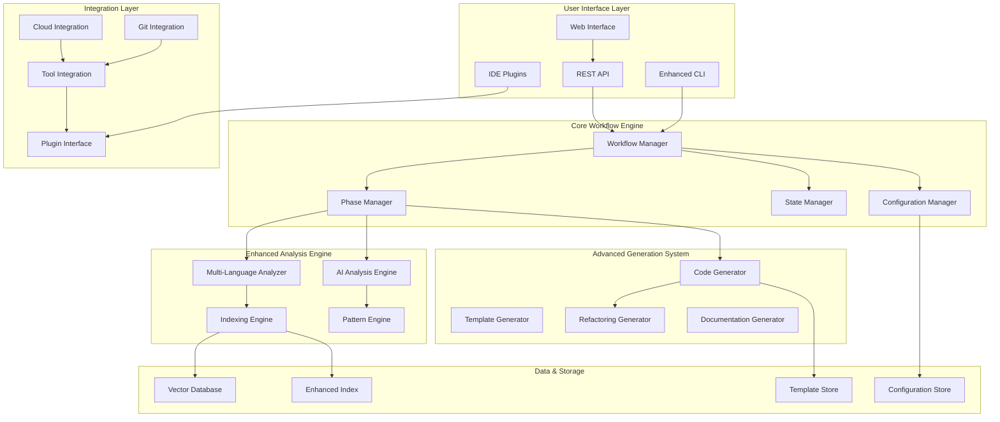

# Dev-Agent Enhancement Suite Design Document

## Overview

The dev-agent enhancement suite builds upon the existing four-phase workflow system to create a comprehensive, enterprise-ready development assistant. The design focuses on three core enhancement areas: User Experience & Interface, Advanced AI Capabilities, and Production & Integration Features.

The enhanced system maintains backward compatibility with the existing MVP while introducing modular enhancements that can be enabled incrementally. The architecture emphasizes extensibility, performance, and user customization while preserving the core workflow that users already understand.

## Architecture

### Enhanced System Architecture



### Component Enhancement Strategy

The design follows a modular enhancement approach where each component can be upgraded independently:

1. **Core Preservation**: Existing workflow engine remains unchanged
2. **Interface Enhancement**: New UI components wrap existing functionality
3. **Analysis Expansion**: Multi-language support extends current indexing
4. **Generation Evolution**: Advanced generators build on existing patterns
5. **Integration Addition**: New integrations plug into existing interfaces

## Components and Interfaces

### Enhanced User Interface System

```python
class EnhancedCLI:
    def __init__(self, workflow_manager: WorkflowManager, ui_config: UIConfig):
        self.workflow_manager = workflow_manager
        self.ui_config = ui_config
        self.console = Console(theme=ui_config.theme)
        self.progress_manager = ProgressManager()
        self.visualization_engine = VisualizationEngine()
    
    def display_rich_progress(self, phase: PhaseType, progress: float) -> None
    def show_interactive_diff(self, old_content: str, new_content: str) -> bool
    def render_architecture_diagram(self, analysis: ArchitectureAnalysis) -> None
    def provide_contextual_help(self, current_context: WorkflowContext) -> None
    def handle_undo_redo(self, action: UndoRedoAction) -> bool

class WebInterface:
    def __init__(self, api_client: APIClient):
        self.api_client = api_client
        self.websocket_manager = WebSocketManager()
        self.collaboration_engine = CollaborationEngine()
    
    def serve_dashboard(self) -> FastAPIApp
    def handle_real_time_updates(self, project_id: str) -> None
    def manage_collaborative_sessions(self, session_id: str) -> None

class IDEPlugin:
    def __init__(self, ide_type: IDEType, plugin_config: PluginConfig):
        self.ide_type = ide_type
        self.plugin_config = plugin_config
        self.command_bridge = CommandBridge()
    
    def register_commands(self) -> List[Command]
    def handle_file_events(self, event: FileEvent) -> None
    def provide_inline_suggestions(self, context: CodeContext) -> List[Suggestion]
```

### Multi-Language Analysis Engine

```python
class MultiLanguageAnalyzer:
    def __init__(self, language_configs: Dict[str, LanguageConfig]):
        self.language_configs = language_configs
        self.parsers = {}
        self.framework_detectors = {}
        self.pattern_analyzers = {}
    
    def detect_project_languages(self, project_path: str) -> List[LanguageInfo]
    def analyze_framework_usage(self, project_path: str) -> List[FrameworkInfo]
    def extract_language_patterns(self, language: str, files: List[str]) -> LanguagePatterns
    def generate_cross_language_mappings(self, project: ProjectInfo) -> CrossLanguageMappings

class FrameworkIntelligence:
    def __init__(self, framework_registry: FrameworkRegistry):
        self.framework_registry = framework_registry
        self.pattern_matchers = {}
        self.convention_analyzers = {}
    
    def detect_frameworks(self, project_analysis: ProjectAnalysis) -> List[Framework]
    def analyze_framework_conventions(self, framework: Framework, codebase: CodebaseIndex) -> Conventions
    def suggest_framework_improvements(self, framework_usage: FrameworkUsage) -> List[Improvement]

class AIAnalysisEngine:
    def __init__(self, ai_service: AIService, analysis_config: AnalysisConfig):
        self.ai_service = ai_service
        self.analysis_config = analysis_config
        self.quality_analyzer = CodeQualityAnalyzer()
        self.security_analyzer = SecurityAnalyzer()
        self.performance_analyzer = PerformanceAnalyzer()
    
    def analyze_code_quality(self, code: str, language: str) -> QualityAnalysis
    def detect_security_issues(self, codebase: CodebaseIndex) -> List[SecurityIssue]
    def identify_performance_bottlenecks(self, code: str) -> List[PerformanceIssue]
    def suggest_architectural_improvements(self, architecture: Architecture) -> List[ArchitecturalSuggestion]
```

### Advanced Code Generation System

```python
class IntelligentCodeGenerator:
    def __init__(self, pattern_engine: PatternEngine, refactoring_engine: RefactoringEngine):
        self.pattern_engine = pattern_engine
        self.refactoring_engine = refactoring_engine
        self.template_manager = TemplateManager()
        self.consistency_checker = ConsistencyChecker()
    
    def generate_with_refactoring(self, task: Task, context: CodeContext) -> GenerationResult
    def generate_comprehensive_tests(self, code: str, test_config: TestConfig) -> TestSuite
    def update_related_files(self, primary_change: CodeChange) -> List[RelatedChange]
    def ensure_architectural_consistency(self, new_code: str, architecture: Architecture) -> str

class TemplateSystem:
    def __init__(self, template_store: TemplateStore):
        self.template_store = template_store
        self.template_engine = Jinja2Environment()
        self.customization_manager = CustomizationManager()
    
    def create_project_scaffold(self, project_spec: ProjectSpec) -> ProjectStructure
    def generate_from_template(self, template_id: str, context: TemplateContext) -> GeneratedFiles
    def customize_template(self, template_id: str, customizations: List[Customization]) -> Template
    def validate_template_consistency(self, template: Template) -> ValidationResult

class RefactoringEngine:
    def __init__(self, language_configs: Dict[str, LanguageConfig]):
        self.language_configs = language_configs
        self.refactoring_strategies = {}
        self.impact_analyzer = ImpactAnalyzer()
    
    def identify_refactoring_opportunities(self, codebase: CodebaseIndex) -> List[RefactoringOpportunity]
    def apply_refactoring(self, refactoring: Refactoring, codebase: CodebaseIndex) -> RefactoringResult
    def analyze_refactoring_impact(self, refactoring: Refactoring) -> ImpactAnalysis
```

### Integration & Collaboration System

```python
class GitIntegration:
    def __init__(self, git_config: GitConfig):
        self.git_config = git_config
        self.commit_analyzer = CommitAnalyzer()
        self.branch_manager = BranchManager()
        self.merge_assistant = MergeAssistant()
    
    def generate_intelligent_commits(self, changes: List[FileChange]) -> List[Commit]
    def manage_feature_branches(self, feature: Feature) -> BranchStrategy
    def resolve_merge_conflicts(self, conflicts: List[MergeConflict]) -> List[Resolution]
    def analyze_commit_history(self, repository: Repository) -> CommitAnalysis

class CloudIntegration:
    def __init__(self, cloud_providers: List[CloudProvider]):
        self.cloud_providers = cloud_providers
        self.deployment_manager = DeploymentManager()
        self.infrastructure_generator = InfrastructureGenerator()
    
    def configure_cloud_deployment(self, project: Project, cloud: CloudProvider) -> DeploymentConfig
    def generate_infrastructure_code(self, requirements: InfrastructureRequirements) -> InfrastructureCode
    def setup_monitoring_and_logging(self, deployment: Deployment) -> MonitoringConfig

class ToolIntegration:
    def __init__(self, integration_registry: IntegrationRegistry):
        self.integration_registry = integration_registry
        self.plugin_manager = PluginManager()
        self.api_bridge = APIBridge()
    
    def register_tool_integration(self, tool: Tool, integration: Integration) -> None
    def sync_with_external_tools(self, project: Project) -> SyncResult
    def handle_webhook_events(self, event: WebhookEvent) -> None
```

## Data Models

### Enhanced Project State

```python
@dataclass
class EnhancedProjectState:
    # Existing fields
    project_path: str
    current_phase: PhaseType
    indexing_complete: bool
    specification: Optional[SpecificationDocument]
    design: Optional[DesignDocument]
    tasks: Optional[TaskList]
    implementation_progress: Dict[str, TaskStatus]
    
    # Enhanced fields
    languages_detected: List[LanguageInfo]
    frameworks_detected: List[FrameworkInfo]
    architecture_analysis: Optional[ArchitectureAnalysis]
    quality_metrics: Optional[QualityMetrics]
    customizations: Dict[str, Any]
    integration_configs: Dict[str, IntegrationConfig]
    collaboration_settings: Optional[CollaborationSettings]
    performance_profile: Optional[PerformanceProfile]

@dataclass
class LanguageInfo:
    language: str
    version: Optional[str]
    file_count: int
    line_count: int
    frameworks: List[str]
    conventions: LanguageConventions
    quality_score: float

@dataclass
class FrameworkInfo:
    name: str
    version: str
    usage_patterns: List[UsagePattern]
    configuration_files: List[str]
    best_practices_compliance: float
    suggested_improvements: List[Improvement]
```

### Advanced Analysis Models

```python
@dataclass
class ArchitectureAnalysis:
    architectural_patterns: List[ArchitecturalPattern]
    component_relationships: Dict[str, List[str]]
    dependency_graph: DependencyGraph
    layer_violations: List[LayerViolation]
    coupling_metrics: CouplingMetrics
    cohesion_metrics: CohesionMetrics
    suggested_refactorings: List[ArchitecturalRefactoring]

@dataclass
class QualityMetrics:
    overall_score: float
    maintainability_index: float
    cyclomatic_complexity: Dict[str, float]
    code_coverage: float
    technical_debt_ratio: float
    security_score: float
    performance_score: float
    documentation_coverage: float

@dataclass
class GenerationContext:
    target_language: str
    framework_context: FrameworkContext
    existing_patterns: List[CodePattern]
    architectural_constraints: List[Constraint]
    quality_requirements: QualityRequirements
    team_conventions: TeamConventions
    integration_requirements: List[IntegrationRequirement]
```

### Template and Customization Models

```python
@dataclass
class ProjectTemplate:
    id: str
    name: str
    description: str
    languages: List[str]
    frameworks: List[str]
    project_type: ProjectType
    file_templates: Dict[str, FileTemplate]
    configuration_templates: Dict[str, ConfigTemplate]
    customization_points: List[CustomizationPoint]
    prerequisites: List[Prerequisite]

@dataclass
class CustomizationProfile:
    id: str
    name: str
    team_id: Optional[str]
    coding_standards: CodingStandards
    architectural_preferences: ArchitecturalPreferences
    tool_configurations: Dict[str, ToolConfig]
    template_overrides: Dict[str, TemplateOverride]
    quality_thresholds: QualityThresholds
```

## Error Handling

### Enhanced Error Management

```python
class EnhancedErrorHandler:
    def __init__(self, error_config: ErrorConfig):
        self.error_config = error_config
        self.recovery_strategies = {}
        self.user_feedback_manager = UserFeedbackManager()
        self.error_analytics = ErrorAnalytics()
    
    def handle_multi_language_error(self, error: MultiLanguageError) -> RecoveryAction
    def handle_integration_error(self, error: IntegrationError) -> IntegrationRecovery
    def handle_generation_error(self, error: GenerationError) -> GenerationRecovery
    def handle_collaboration_error(self, error: CollaborationError) -> CollaborationRecovery
    def provide_intelligent_suggestions(self, error: Error, context: ErrorContext) -> List[Suggestion]

class ErrorRecoveryStrategies:
    def progressive_language_support(self, unsupported_language: str) -> LanguageRecovery
    def graceful_integration_degradation(self, failed_integration: str) -> IntegrationFallback
    def incremental_generation_retry(self, failed_generation: GenerationTask) -> GenerationRetry
    def collaborative_conflict_resolution(self, conflict: CollaborationConflict) -> ConflictResolution
```

## Testing Strategy

### Comprehensive Testing Approach

```python
class EnhancedTestSuite:
    def __init__(self, test_config: TestConfig):
        self.test_config = test_config
        self.multi_language_tester = MultiLanguageTester()
        self.integration_tester = IntegrationTester()
        self.performance_tester = PerformanceTester()
        self.ui_tester = UITester()
    
    def test_multi_language_support(self, languages: List[str]) -> TestResults
    def test_framework_detection(self, sample_projects: List[Project]) -> TestResults
    def test_integration_reliability(self, integrations: List[Integration]) -> TestResults
    def test_ui_responsiveness(self, ui_components: List[UIComponent]) -> TestResults
    def test_collaboration_features(self, collaboration_scenarios: List[Scenario]) -> TestResults

class PerformanceTestSuite:
    def test_large_multi_language_indexing(self, project_size: ProjectSize) -> PerformanceMetrics
    def test_concurrent_user_handling(self, user_count: int) -> ConcurrencyMetrics
    def test_real_time_collaboration(self, session_count: int) -> CollaborationMetrics
    def test_cloud_integration_latency(self, cloud_providers: List[CloudProvider]) -> LatencyMetrics
```

## Integration Architecture

### Plugin and Extension System

```python
class PluginArchitecture:
    def __init__(self, plugin_registry: PluginRegistry):
        self.plugin_registry = plugin_registry
        self.plugin_loader = PluginLoader()
        self.api_gateway = APIGateway()
        self.security_manager = PluginSecurityManager()
    
    def load_plugin(self, plugin_id: str) -> Plugin
    def validate_plugin_security(self, plugin: Plugin) -> SecurityValidation
    def manage_plugin_lifecycle(self, plugin: Plugin) -> LifecycleManager
    def provide_plugin_api(self, plugin: Plugin) -> PluginAPI

class IntegrationBridge:
    def __init__(self, bridge_config: BridgeConfig):
        self.bridge_config = bridge_config
        self.protocol_adapters = {}
        self.data_transformers = {}
        self.event_handlers = {}
    
    def create_tool_adapter(self, tool: ExternalTool) -> ToolAdapter
    def transform_data_format(self, data: Any, source_format: str, target_format: str) -> Any
    def handle_external_events(self, event: ExternalEvent) -> InternalEvent
```

## Performance Optimization

### Scalability Enhancements

```python
class PerformanceOptimizer:
    def __init__(self, perf_config: PerformanceConfig):
        self.perf_config = perf_config
        self.cache_manager = CacheManager()
        self.parallel_processor = ParallelProcessor()
        self.memory_optimizer = MemoryOptimizer()
    
    def optimize_multi_language_indexing(self, languages: List[str]) -> OptimizationStrategy
    def implement_intelligent_caching(self, access_patterns: AccessPatterns) -> CacheStrategy
    def enable_parallel_processing(self, tasks: List[Task]) -> ParallelStrategy
    def optimize_memory_usage(self, memory_profile: MemoryProfile) -> MemoryStrategy

class ScalabilityManager:
    def handle_large_team_collaboration(self, team_size: int) -> CollaborationStrategy
    def manage_distributed_indexing(self, cluster_config: ClusterConfig) -> DistributedStrategy
    def implement_load_balancing(self, load_profile: LoadProfile) -> LoadBalancingStrategy
```

## Security and Privacy

### Security Framework

```python
class SecurityManager:
    def __init__(self, security_config: SecurityConfig):
        self.security_config = security_config
        self.access_controller = AccessController()
        self.encryption_manager = EncryptionManager()
        self.audit_logger = AuditLogger()
    
    def validate_code_generation_safety(self, generated_code: str) -> SecurityValidation
    def encrypt_sensitive_project_data(self, data: ProjectData) -> EncryptedData
    def manage_team_access_controls(self, team: Team, resources: List[Resource]) -> AccessPolicy
    def audit_system_activities(self, activities: List[Activity]) -> AuditReport

class PrivacyProtection:
    def anonymize_code_samples(self, code: str) -> AnonymizedCode
    def protect_proprietary_patterns(self, patterns: List[CodePattern]) -> ProtectedPatterns
    def manage_data_retention(self, data_types: List[DataType]) -> RetentionPolicy
```

## Deployment and Distribution

### Enhanced Deployment Strategy

```python
class DeploymentManager:
    def __init__(self, deployment_config: DeploymentConfig):
        self.deployment_config = deployment_config
        self.container_manager = ContainerManager()
        self.cloud_deployer = CloudDeployer()
        self.update_manager = UpdateManager()
    
    def create_containerized_deployment(self, project: Project) -> ContainerDeployment
    def deploy_to_cloud_platforms(self, deployment: Deployment, platforms: List[CloudPlatform]) -> DeploymentResult
    def manage_rolling_updates(self, update: Update) -> UpdateResult
    def handle_deployment_rollbacks(self, deployment_id: str) -> RollbackResult

class DistributionStrategy:
    def package_for_enterprise(self, features: List[Feature]) -> EnterprisePackage
    def create_plugin_marketplace(self, plugins: List[Plugin]) -> Marketplace
    def manage_license_compliance(self, licenses: List[License]) -> ComplianceReport
```

## Migration and Compatibility

### Backward Compatibility Strategy

The enhancement suite maintains full backward compatibility with the existing MVP:

1. **API Compatibility**: All existing CLI commands and workflows remain unchanged
2. **Data Migration**: Automatic migration of existing project states to enhanced format
3. **Gradual Enhancement**: Features can be enabled incrementally without disrupting existing workflows
4. **Fallback Mechanisms**: System gracefully degrades to MVP functionality if enhanced features fail

```python
class CompatibilityManager:
    def migrate_existing_projects(self, projects: List[Project]) -> MigrationResult
    def ensure_api_compatibility(self, api_changes: List[APIChange]) -> CompatibilityReport
    def provide_feature_toggles(self, features: List[Feature]) -> FeatureToggleConfig
    def handle_version_conflicts(self, conflicts: List[VersionConflict]) -> ConflictResolution
```

This design provides a comprehensive roadmap for transforming dev-agent from a functional MVP into a sophisticated, enterprise-ready development assistant while maintaining the simplicity and effectiveness that makes the current system valuable.