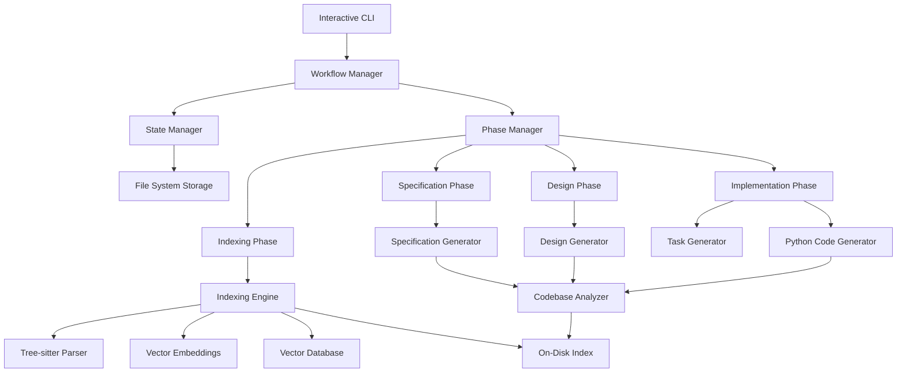

# Design Document

## Overview

The dev-agent system is designed as a high-performance, indexing-first architecture that implements a four-phase workflow: Indexing, Specification, Design, and Implementation. The system is built Python-first with a focus on analyzing and working with existing large codebases through comprehensive local indexing.

The core architecture centers around a persistent, on-disk indexing engine capable of handling repositories with millions of lines of code. The system uses Tree-sitter for AST parsing and vector embeddings for semantic code analysis, enabling context-aware code generation that maintains consistency with existing patterns. The workflow is interactive and requires explicit user approval at each phase transition.

## Architecture

### High-Level Architecture



### Core Components

1. **Interactive CLI**: Chat-based command-line interface with approval workflows
2. **Workflow Manager**: Orchestrates the four-phase development process (Index → Specify → Design → Implement)
3. **State Manager**: Maintains project state with session persistence in local files
4. **Indexing Engine**: High-performance codebase analysis using Tree-sitter and vector embeddings
5. **Phase Manager**: Manages transitions between phases with explicit user approval requirements
6. **Codebase Analyzer**: Leverages the persistent index for context-aware analysis and code generation
7. **Python Code Generator**: Generates Python code consistent with existing codebase patterns

## Components and Interfaces

### Interactive CLI

```python
class InteractiveCLI:
    def __init__(self, workflow_manager: WorkflowManager):
        self.workflow_manager = workflow_manager
        self.session_active = False
    
    def start_chat_session(self) -> None
    def handle_user_input(self, input_text: str) -> str
    def request_approval(self, document: str, document_type: str) -> bool
    def display_progress(self, phase: PhaseType, progress: float) -> None
    def init_command(self, project_path: str) -> None

class WorkflowManager:
    def __init__(self, state_manager: StateManager, phase_manager: PhaseManager, indexing_engine: IndexingEngine):
        self.state_manager = state_manager
        self.phase_manager = phase_manager
        self.indexing_engine = indexing_engine
        self.current_phase = PhaseType.INDEXING
    
    def start_new_project(self, project_path: str) -> ProjectState
    def resume_project(self, project_path: str) -> ProjectState
    def transition_to_phase(self, phase: PhaseType) -> bool
    def require_user_approval(self, content: str, phase: PhaseType) -> bool

### Indexing Engine

```python
class IndexingEngine:
    def __init__(self, project_path: str):
        self.project_path = project_path
        self.index_path = os.path.join(project_path, '.dev_agent', 'index')
        self.tree_sitter_parser = TreeSitterParser()
        self.vector_db = VectorDatabase(self.index_path)
    
    def build_index(self) -> IndexResult
    def parse_codebase_ast(self) -> ASTIndex
    def generate_embeddings(self, code_chunks: List[CodeChunk]) -> List[Embedding]
    def store_embeddings(self, embeddings: List[Embedding]) -> bool
    def query_similar_code(self, query: str, limit: int = 10) -> List[CodeMatch]
    def get_symbol_map(self) -> Dict[str, SymbolInfo]

class PhaseManager:
    def execute_indexing_phase(self, project_path: str) -> IndexingResult
    def execute_specification_phase(self, context: ProjectContext) -> SpecificationResult
    def execute_design_phase(self, context: ProjectContext) -> DesignResult
    def execute_implementation_phase(self, context: ProjectContext) -> ImplementationResult
    def validate_phase_completion(self, phase: PhaseType, result: PhaseResult) -> bool

### State Manager

```python
class StateManager:
    def __init__(self, project_path: str):
        self.project_path = project_path
        self.state_file = os.path.join(project_path, '.dev_agent', 'state.json')
    
    def save_project_state(self, state: ProjectState) -> bool
    def load_project_state(self) -> Optional[ProjectState]
    def update_phase_status(self, phase: PhaseType, status: PhaseStatus) -> bool
    def save_document(self, document: str, doc_type: DocumentType) -> bool
    def load_document(self, doc_type: DocumentType) -> Optional[str]
    def track_task_progress(self, task_id: str, progress: TaskProgress) -> bool

### Python Code Generator

```python
class PythonCodeGenerator:
    def __init__(self, codebase_analyzer: CodebaseAnalyzer):
        self.codebase_analyzer = codebase_analyzer
        self.existing_patterns = None
    
    def analyze_existing_patterns(self) -> CodePatterns
    def generate_code_from_task(self, task: Task, context: CodeContext) -> GeneratedCode
    def ensure_consistency(self, new_code: str, existing_codebase: CodebaseIndex) -> str
    def generate_tests(self, code: str, test_framework: str = "pytest") -> str
    def write_code_to_file(self, code: str, file_path: str) -> bool

### Codebase Analyzer

```python
class CodebaseAnalyzer:
    def __init__(self, indexing_engine: IndexingEngine):
        self.indexing_engine = indexing_engine
        self.index = None
    
    def analyze_for_specification(self) -> SpecificationAnalysis
    def analyze_for_design(self) -> DesignAnalysis
    def extract_architecture_patterns(self) -> ArchitectureInfo
    def identify_code_patterns(self) -> CodePatterns
    def find_similar_implementations(self, query: str) -> List[CodeExample]
    def get_context_for_task(self, task: Task) -> CodeContext

## Data Models

### Project State

```python
@dataclass
class ProjectState:
    project_path: str
    current_phase: PhaseType
    indexing_complete: bool
    specification: Optional[SpecificationDocument]
    design: Optional[DesignDocument]
    tasks: Optional[TaskList]
    implementation_progress: Dict[str, TaskStatus]
    index_metadata: IndexMetadata
    session_data: SessionData
    created_at: datetime
    updated_at: datetime

@dataclass
class IndexMetadata:
    total_files: int
    total_lines: int
    languages_detected: List[str]
    index_size_mb: float
    last_indexed: datetime
    index_version: str

### Specification Document

```python
@dataclass
class SpecificationDocument:
    introduction: str
    key_features: List[str]
    functional_requirements: List[Requirement]
    source: SpecificationSource  # EXISTING_CODE or USER_INPUT
    version: str
    approved: bool
    approval_timestamp: Optional[datetime]

@dataclass
class Requirement:
    id: str
    user_story: str
    acceptance_criteria: List[str]
    priority: Priority
    source_analysis: Optional[CodeAnalysisRef]  # Reference to code that informed this requirement

@dataclass
class CodeAnalysisRef:
    file_paths: List[str]
    functions: List[str]
    confidence_score: float

### Design Document

```python
@dataclass
class DesignDocument:
    overview: str
    architecture: ArchitectureDescription
    components: List[ComponentSpec]
    data_models: List[DataModel]
    interfaces: List[InterfaceSpec]
    error_handling: ErrorHandlingStrategy
    testing_strategy: TestingStrategy
    version: str
    approved: bool
```

### Task List

```python
@dataclass
class TaskList:
    tasks: List[Task]
    dependencies: Dict[str, List[str]]
    estimated_effort: Dict[str, int]
    version: str
    approved: bool

@dataclass
class Task:
    id: str
    title: str
    description: str
    requirements_refs: List[str]
    subtasks: List[str]
    status: TaskStatus
    target_language: str = "python"  # MVP focuses on Python
    context_requirements: List[str]  # What codebase context is needed
    implementation_notes: Optional[str]
    generated_files: List[str]  # Files created/modified by this task

## Error Handling

### Error Categories

1. **Indexing Errors**: Large file handling, memory constraints, parsing failures
2. **User Input Errors**: Invalid approval responses, conflicting feedback
3. **System Errors**: File I/O issues, state persistence failures
4. **Implementation Errors**: Python syntax errors, import failures, test failures
5. **Performance Errors**: Index corruption, memory exhaustion, timeout issues

### Error Handling Strategy

```python
class ErrorHandler:
    def handle_indexing_error(self, error: IndexingError) -> IndexingRecoveryAction
    def handle_user_input_error(self, error: UserInputError) -> UserFeedback
    def handle_system_error(self, error: SystemError) -> SystemRecoveryAction
    def handle_implementation_error(self, error: ImplementationError) -> ImplementationFix
    def handle_performance_error(self, error: PerformanceError) -> PerformanceOptimization
```

### Recovery Mechanisms

- **Progressive Indexing**: Handle large codebases in chunks to avoid memory issues
- **Graceful Degradation**: Continue with partial index if full indexing fails
- **State Recovery**: Restore from last known good state using persistent storage
- **User Intervention**: Request user guidance for approval and feedback loops
- **Incremental Processing**: Process files incrementally to handle resource constraints

## Testing Strategy

### Unit Testing

- Test indexing engine components in isolation
- Mock Tree-sitter and vector database operations
- Focus on phase transitions and state management
- Test Python code generation logic
- Achieve 90%+ code coverage for core components

### Integration Testing

- Test complete indexing workflow on sample codebases
- Test phase transitions with user approval simulation
- Test file system operations and state persistence
- Test codebase analysis with real Python projects

### Performance Testing

- Test indexing performance on large codebases (100k+ lines)
- Memory usage profiling during indexing operations
- Vector database query performance testing
- State persistence and recovery performance

### End-to-End Testing

- Complete four-phase workflow scenarios
- Existing codebase analysis and specification generation
- Python code generation consistency testing
- Error recovery and graceful degradation testing

### Test Data Management

```python
class TestDataManager:
    def create_sample_python_project(self, size: ProjectSize) -> str
    def create_large_codebase(self, lines_of_code: int) -> str
    def generate_test_specifications(self, domain: str) -> SpecificationDocument
    def create_mock_index(self, complexity: ComplexityLevel) -> IndexingEngine
```

## Indexing Architecture

### Tree-sitter Integration

```python
class TreeSitterParser:
    def __init__(self):
        self.supported_languages = ['python', 'javascript', 'java', 'cpp']
        self.parsers = {}
    
    def parse_file(self, file_path: str, language: str) -> AST
    def extract_symbols(self, ast: AST) -> List[Symbol]
    def get_function_definitions(self, ast: AST) -> List[FunctionDef]
    def get_class_definitions(self, ast: AST) -> List[ClassDef]
    def extract_imports(self, ast: AST) -> List[Import]
```

### Vector Database Integration

```python
class VectorDatabase:
    def __init__(self, index_path: str):
        self.index_path = index_path
        self.embedding_model = "sentence-transformers/code-search-net"
    
    def store_embeddings(self, embeddings: List[CodeEmbedding]) -> bool
    def query_similar(self, query_embedding: Embedding, k: int = 10) -> List[Match]
    def update_embedding(self, code_id: str, embedding: Embedding) -> bool
    def get_embedding_stats(self) -> EmbeddingStats
```

### Performance Optimization

- **Memory-mapped files** for large index storage
- **Incremental indexing** to handle updates efficiently  
- **Chunked processing** to avoid memory exhaustion
- **Lazy loading** of index components as needed

## Integration Points

### File System Integration

- Store all state in `.dev_agent/` directory within project
- Respect existing project structure and conventions
- Generate Python files following project patterns
- Handle file permissions and directory creation

### Python Ecosystem Integration

- Detect existing Python project structure (setup.py, pyproject.toml, requirements.txt)
- Generate code compatible with existing imports and dependencies
- Support common Python testing frameworks (pytest, unittest)
- Follow PEP 8 and existing code style conventions

### Development Workflow Integration

- Maintain session state across CLI restarts
- Support iterative development with approval checkpoints
- Generate code that integrates with existing modules
- Preserve existing file structure and naming conventions

**Note**: Advanced Git integration, IDE plugins, and cross-platform installers are deferred to post-MVP as specified in requirements.

## Performance Considerations

### Indexing Performance

- **Target**: Handle 1M+ lines of code on standard developer machines
- **Memory Management**: Use memory-mapped files and on-disk data structures
- **Progressive Processing**: Index files in batches to avoid memory exhaustion
- **Persistent Storage**: One-time expensive analysis with persistent on-disk index

### Scalability Design Decisions

- **On-disk Index**: Store all analysis results persistently to avoid re-computation
- **Chunked Embeddings**: Process code in manageable chunks for vector generation
- **Lazy Loading**: Load index components only when needed for specific queries
- **Incremental Updates**: Support updating index when files change (post-MVP)

### Resource Management

- **Memory Limits**: Implement safeguards to prevent excessive RAM usage
- **Timeout Mechanisms**: Set reasonable timeouts for indexing operations
- **Progress Indicators**: Show indexing progress for large codebases
- **Graceful Degradation**: Continue with partial index if full indexing fails

### Query Performance

- **Vector Search Optimization**: Use efficient similarity search algorithms
- **Symbol Lookup**: Fast symbol and function lookup through indexed AST
- **Context Retrieval**: Quick access to relevant code context for generation tasks

## MVP Design Decisions and Rationales

### Python-First Approach
**Decision**: Focus exclusively on Python code generation for MVP  
**Rationale**: Reduces complexity while providing immediate value. Python's popularity and readability make it ideal for demonstrating the system's capabilities. Multi-language support can be added post-MVP.

### Interactive CLI with Approval Gates
**Decision**: Require explicit user approval (y/n) at each phase transition  
**Rationale**: Ensures user control and prevents the system from making unwanted changes. Builds trust and allows for iterative refinement of generated documents.

### On-Disk Indexing Strategy
**Decision**: Build persistent, local index using Tree-sitter + vector embeddings  
**Rationale**: Enables handling of large codebases (1M+ lines) without performance degradation. One-time indexing cost provides long-term benefits for context-aware code generation.

### Four-Phase Workflow
**Decision**: Add explicit Indexing phase before traditional Specify → Design → Implement  
**Rationale**: Existing codebases require analysis before specification generation. This phase provides the foundation for all subsequent context-aware operations.

### Deferred Features Rationale
**Decision**: Defer Git integration, security sandboxing, and cross-platform installers  
**Rationale**: These features add significant complexity without directly contributing to the core value proposition. Focusing on the indexing and generation workflow provides a solid foundation for future enhancements.

### Local State Management
**Decision**: Store all state in project's `.dev_agent/` directory  
**Rationale**: Keeps project-specific state co-located with the codebase. Enables session resumption and provides transparency about system artifacts.