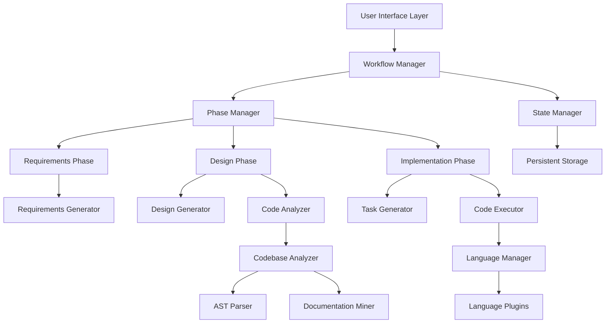

# Design Document

## Overview

The Software Development Agent Specification System is designed as a modular, state-driven architecture that guides users through three distinct phases: Requirements Gathering, Design Creation, and Implementation. The system employs a plugin-based approach to support multiple programming languages and frameworks while maintaining a consistent workflow experience.

The core architecture follows the Command Pattern with State Management, allowing for complex workflow orchestration while maintaining the ability to backtrack and modify earlier phases. The system integrates with existing development tools through standardized interfaces and file formats.

## Architecture

### High-Level Architecture



### Core Components

1. **Workflow Manager**: Orchestrates the three-phase development process
2. **State Manager**: Maintains project state and handles persistence
3. **Phase Manager**: Manages transitions between requirements, design, and implementation phases
4. **Language Manager**: Handles multi-language support through plugin architecture
5. **Code Analyzer**: Analyzes existing codebases to generate specifications
6. **Code Executor**: Implements tasks using specified development methodologies

## Components and Interfaces

### Workflow Manager

```python
class WorkflowManager:
    def __init__(self, state_manager: StateManager, phase_manager: PhaseManager):
        self.state_manager = state_manager
        self.phase_manager = phase_manager
        self.current_phase = None
    
    def start_new_project(self, project_config: ProjectConfig) -> ProjectState
    def resume_project(self, project_id: str) -> ProjectState
    def transition_to_phase(self, phase: PhaseType) -> bool
    def handle_user_feedback(self, feedback: UserFeedback) -> ActionResult
```

### Phase Manager

```python
class PhaseManager:
    def execute_requirements_phase(self, context: ProjectContext) -> RequirementsResult
    def execute_design_phase(self, context: ProjectContext) -> DesignResult
    def execute_implementation_phase(self, context: ProjectContext) -> ImplementationResult
    def validate_phase_completion(self, phase: PhaseType, result: PhaseResult) -> bool
```

### State Manager

```python
class StateManager:
    def save_project_state(self, project_id: str, state: ProjectState) -> bool
    def load_project_state(self, project_id: str) -> ProjectState
    def update_phase_status(self, project_id: str, phase: PhaseType, status: PhaseStatus) -> bool
    def track_task_progress(self, project_id: str, task_id: str, progress: TaskProgress) -> bool
```

### Language Manager

```python
class LanguageManager:
    def get_language_plugin(self, language: str) -> LanguagePlugin
    def register_plugin(self, plugin: LanguagePlugin) -> bool
    def get_supported_languages(self) -> List[str]
    def detect_project_language(self, codebase_path: str) -> str
```

### Code Analyzer

```python
class CodeAnalyzer:
    def analyze_existing_codebase(self, path: str) -> CodebaseAnalysis
    def extract_architecture_patterns(self, analysis: CodebaseAnalysis) -> ArchitectureInfo
    def generate_design_from_code(self, analysis: CodebaseAnalysis) -> DesignDocument
    def identify_missing_documentation(self, analysis: CodebaseAnalysis) -> List[DocumentationGap]
```

## Data Models

### Project State

```python
@dataclass
class ProjectState:
    project_id: str
    name: str
    description: str
    current_phase: PhaseType
    requirements: Optional[RequirementsDocument]
    design: Optional[DesignDocument]
    tasks: Optional[TaskList]
    implementation_progress: Dict[str, TaskStatus]
    language_config: LanguageConfig
    user_preferences: UserPreferences
    created_at: datetime
    updated_at: datetime
```

### Requirements Document

```python
@dataclass
class RequirementsDocument:
    introduction: str
    requirements: List[Requirement]
    version: str
    approved: bool
    approval_timestamp: Optional[datetime]

@dataclass
class Requirement:
    id: str
    user_story: str
    acceptance_criteria: List[str]
    priority: Priority
    dependencies: List[str]
```

### Design Document

```python
@dataclass
class DesignDocument:
    overview: str
    architecture: ArchitectureDescription
    components: List[ComponentSpec]
    data_models: List[DataModel]
    interfaces: List[InterfaceSpec]
    error_handling: ErrorHandlingStrategy
    testing_strategy: TestingStrategy
    version: str
    approved: bool
```

### Task List

```python
@dataclass
class TaskList:
    tasks: List[Task]
    dependencies: Dict[str, List[str]]
    estimated_effort: Dict[str, int]
    version: str
    approved: bool

@dataclass
class Task:
    id: str
    title: str
    description: str
    requirements_refs: List[str]
    subtasks: List[str]
    status: TaskStatus
    implementation_notes: Optional[str]
```

## Error Handling

### Error Categories

1. **User Input Errors**: Invalid requirements, conflicting specifications
2. **System Errors**: File I/O issues, parsing failures, plugin errors
3. **Implementation Errors**: Code compilation failures, test failures, dependency issues
4. **Integration Errors**: Version control conflicts, build system issues

### Error Handling Strategy

```python
class ErrorHandler:
    def handle_user_input_error(self, error: UserInputError) -> UserFeedback
    def handle_system_error(self, error: SystemError) -> SystemRecoveryAction
    def handle_implementation_error(self, error: ImplementationError) -> ImplementationFix
    def handle_integration_error(self, error: IntegrationError) -> IntegrationSolution
```

### Recovery Mechanisms

- **Automatic Retry**: For transient system errors
- **Rollback**: Return to last known good state
- **Alternative Approach**: Try different implementation strategies
- **User Intervention**: Request user guidance for complex issues

## Testing Strategy

### Unit Testing

- Test each component in isolation
- Mock external dependencies
- Focus on business logic and state transitions
- Achieve 90%+ code coverage

### Integration Testing

- Test phase transitions
- Test file system operations
- Test language plugin integration
- Test codebase analysis workflows

### End-to-End Testing

- Complete workflow scenarios
- Multi-language project testing
- Existing codebase analysis testing
- Error recovery testing

### Test Data Management

```python
class TestDataManager:
    def create_sample_project(self, language: str) -> ProjectState
    def create_sample_codebase(self, complexity: ComplexityLevel) -> str
    def generate_test_requirements(self, domain: str) -> RequirementsDocument
```

## Plugin Architecture

### Language Plugin Interface

```python
class LanguagePlugin:
    def get_language_name(self) -> str
    def get_file_extensions(self) -> List[str]
    def analyze_code_structure(self, file_path: str) -> CodeStructure
    def generate_code(self, specification: CodeSpec) -> GeneratedCode
    def run_tests(self, test_config: TestConfig) -> TestResults
    def get_best_practices(self) -> List[BestPractice]
```

### Framework Plugin Interface

```python
class FrameworkPlugin:
    def get_framework_name(self) -> str
    def get_project_template(self) -> ProjectTemplate
    def get_testing_framework(self) -> TestingFramework
    def get_build_configuration(self) -> BuildConfig
    def validate_project_structure(self, path: str) -> ValidationResult
```

## Integration Points

### Version Control Integration

- Respect existing Git workflows
- Create feature branches for implementation
- Generate meaningful commit messages
- Handle merge conflicts gracefully

### IDE Integration

- Generate standard project structures
- Create IDE-compatible configuration files
- Support common debugging workflows
- Integrate with existing linting tools

### Build System Integration

- Support Maven, Gradle, npm, pip, etc.
- Generate appropriate build configurations
- Handle dependency management
- Support CI/CD pipeline integration

## Performance Considerations

### Caching Strategy

- Cache codebase analysis results
- Cache language plugin operations
- Cache generated documentation
- Implement intelligent cache invalidation

### Scalability

- Support large codebases (100k+ lines)
- Handle complex dependency graphs
- Optimize AST parsing operations
- Implement progressive loading for large projects

### Resource Management

- Limit memory usage during analysis
- Implement timeout mechanisms
- Support background processing
- Provide progress indicators for long operations