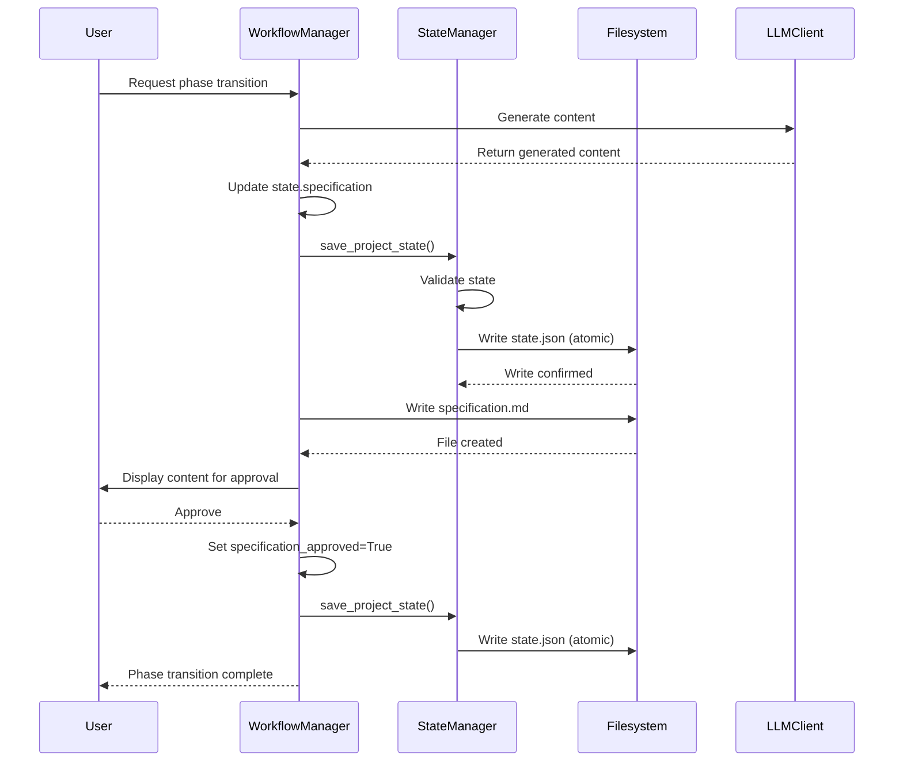

# Design Document: Workflow State Persistence and Document Storage

## Overview

This design addresses critical bugs in the workflow manager's state persistence and document storage mechanisms discovered during end-to-end testing. The core issues involve generated content (specifications, designs, tasks) not being saved to project state or written to disk, preventing phase transitions and losing user work.

The solution implements a robust state management system with atomic updates, comprehensive approval tracking, and reliable document persistence to ensure workflow continuity across sessions.

## Architecture

### High-Level Design

```
┌─────────────────────────────────────────────────────────────┐
│                    Workflow Manager                          │
│  ┌────────────────────────────────────────────────────────┐ │
│  │  Phase Transition Flow                                 │ │
│  │  1. Generate Content (via LLM)                        │ │
│  │  2. Update State with Content ──────────────────────┐ │ │
│  │  3. Save State to Disk (Atomic)                     │ │ │
│  │  4. Write Document to Filesystem                    │ │ │
│  │  5. Request User Approval                           │ │ │
│  │  6. Record Approval in State ───────────────────────┤ │ │
│  │  7. Save State Again (Atomic)                       │ │ │
│  └────────────────────────────────────────────────────────┘ │
└─────────────────────────────────────────────────────────────┘
                            │
                            ▼
┌─────────────────────────────────────────────────────────────┐
│                    State Manager                             │
│  ┌────────────────────────────────────────────────────────┐ │
│  │  State Persistence                                     │ │
│  │  • Validate state consistency                         │ │
│  │  • Serialize to JSON                                  │ │
│  │  • Atomic write (temp file + rename)                 │ │
│  │  • Verify write success                              │ │
│  └────────────────────────────────────────────────────────┘ │
└─────────────────────────────────────────────────────────────┘
                            │
                            ▼
┌─────────────────────────────────────────────────────────────┐
│                  Filesystem Storage                          │
│  .dev_agent/                                                 │
│  ├── state.json (project state with content + approvals)    │
│  └── documents/                                              │
│      ├── specification.md                                    │
│      ├── design.md                                           │
│      └── tasks.md                                            │
└─────────────────────────────────────────────────────────────┘
```

### Component Interactions



## Components and Interfaces

### 1. Enhanced ProjectState Model

**Location**: `dev_agent/models/project_state.py`

**Purpose**: Add approval tracking fields to the existing ProjectState dataclass.

**Design Decision**: Add approval flags as separate boolean fields rather than embedding them in metadata. This provides explicit, type-safe tracking and makes validation logic clearer.

**Interface**:
```python
@dataclass
class ProjectState:
    """Project state with approval tracking."""
    
    # Existing fields
    project_path: str
    current_phase: PhaseType
    indexing_complete: bool = False
    
    # Generated content (EXISTING - ensure these are used)
    specification: str | None = None
    design: str | None = None
    tasks: list[Task] | None = None
    
    # Approval tracking (NEW FIELDS)
    specification_approved: bool = False
    design_approved: bool = False
    tasks_approved: bool = False
    
    # Metadata
    index_metadata: dict | None = None
    implementation_progress: dict = field(default_factory=dict)
    session_data: dict = field(default_factory=dict)
    created_at: str = field(default_factory=lambda: datetime.now().isoformat())
    updated_at: str = field(default_factory=lambda: datetime.now().isoformat())
    
    def update_timestamp(self) -> None:
        """Update the updated_at timestamp."""
        self.updated_at = datetime.now().isoformat()
```

**Rationale**: 
- Explicit approval flags make phase transition validation straightforward
- Backward compatible with existing state files (defaults to False)
- Type-safe with dataclass validation
- Timestamp tracking for audit trail

### 2. Enhanced State Manager

**Location**: `dev_agent/state/state_manager.py`

**Purpose**: Implement robust state persistence with validation and atomic writes.

**Design Decisions**:
- **Atomic Writes**: Use temp file + rename pattern to prevent corruption
- **Validation Before Save**: Catch inconsistencies early
- **Backward Compatibility**: Use `getattr()` with defaults for new fields
- **Comprehensive Serialization**: Include all fields, especially approval flags

**Key Methods**:

```python
class StateManager:
    """Manages project state persistence with validation."""
    
    def save_project_state(self, state: ProjectState) -> None:
        """Save project state with validation and atomic write.
        
        Args:
            state: ProjectState to persist
            
        Raises:
            StateSavingError: If state cannot be saved
            StateValidationError: If state is inconsistent
        """
        # Update timestamp
        state.update_timestamp()
        
        # Validate state consistency
        validation_warnings = self._validate_state(state)
        if validation_warnings:
            logger.warning(f"State validation warnings: {validation_warnings}")
        
        # Serialize state
        try:
            state_dict = self._serialize_state(state)
            
            # Atomic write: temp file + rename
            temp_file = self.state_file.with_suffix('.tmp')
            temp_file.write_text(
                json.dumps(state_dict, indent=2, ensure_ascii=False),
                encoding='utf-8'
            )
            
            # Atomic rename
            temp_file.replace(self.state_file)
            
            logger.info(f"Successfully saved project state to {self.state_file}")
            
        except Exception as e:
            logger.error(f"Failed to save state: {e}", exc_info=True)
            # Clean up temp file if it exists
            if temp_file.exists():
                temp_file.unlink()
            raise StateSavingError(f"Could not save project state: {e}") from e
    
    def _serialize_state(self, state: ProjectState) -> dict:
        """Serialize ProjectState to dictionary.
        
        Args:
            state: ProjectState to serialize
            
        Returns:
            Dictionary representation of state
        """
        return {
            "project_path": state.project_path,
            "current_phase": state.current_phase.value if isinstance(state.current_phase, PhaseType) else state.current_phase,
            "indexing_complete": state.indexing_complete,
            
            # Generated content (full text)
            "specification": state.specification,
            "design": state.design,
            "tasks": self._serialize_tasks(state.tasks) if state.tasks else None,
            
            # Approval flags (NEW)
            "specification_approved": getattr(state, 'specification_approved', False),
            "design_approved": getattr(state, 'design_approved', False),
            "tasks_approved": getattr(state, 'tasks_approved', False),
            
            # Metadata
            "index_metadata": state.index_metadata,
            "implementation_progress": state.implementation_progress,
            "session_data": state.session_data,
            "created_at": state.created_at,
            "updated_at": state.updated_at,
        }
    
    def _serialize_tasks(self, tasks: list[Task]) -> list[dict]:
        """Serialize task list to dictionaries."""
        return [
            {
                "id": task.id,
                "title": task.title,
                "description": task.description,
                "status": task.status.value if isinstance(task.status, TaskStatus) else task.status,
                "dependencies": task.dependencies,
                "metadata": task.metadata,
            }
            for task in tasks
        ]
    
    def _validate_state(self, state: ProjectState) -> list[str]:
        """Validate state consistency.
        
        Args:
            state: ProjectState to validate
            
        Returns:
            List of validation warning messages
        """
        warnings = []
        
        # Check phase consistency
        if state.current_phase == PhaseType.DESIGN:
            if not state.specification:
                warnings.append("Design phase but no specification content")
            if not getattr(state, 'specification_approved', False):
                warnings.append("Design phase but specification not approved")
        
        if state.current_phase == PhaseType.IMPLEMENTATION:
            if not state.design:
                warnings.append("Implementation phase but no design content")
            if not getattr(state, 'design_approved', False):
                warnings.append("Implementation phase but design not approved")
        
        # Check approval consistency
        if getattr(state, 'specification_approved', False) and not state.specification:
            warnings.append("Specification approved but no content")
        
        if getattr(state, 'design_approved', False) and not state.design:
            warnings.append("Design approved but no content")
        
        if getattr(state, 'tasks_approved', False) and not state.tasks:
            warnings.append("Tasks approved but no content")
        
        return warnings
    
    def load_project_state(self, project_path: Path) -> ProjectState:
        """Load project state with backward compatibility.
        
        Args:
            project_path: Path to project
            
        Returns:
            Loaded ProjectState
            
        Raises:
            StateLoadingError: If state cannot be loaded
        """
        state_file = project_path / ".dev_agent" / "state.json"
        
        if not state_file.exists():
            raise StateLoadingError(f"State file not found: {state_file}")
        
        try:
            state_dict = json.loads(state_file.read_text(encoding='utf-8'))
            
            # Deserialize with backward compatibility
            return ProjectState(
                project_path=state_dict["project_path"],
                current_phase=PhaseType(state_dict["current_phase"]),
                indexing_complete=state_dict.get("indexing_complete", False),
                specification=state_dict.get("specification"),
                design=state_dict.get("design"),
                tasks=self._deserialize_tasks(state_dict.get("tasks")),
                specification_approved=state_dict.get("specification_approved", False),
                design_approved=state_dict.get("design_approved", False),
                tasks_approved=state_dict.get("tasks_approved", False),
                index_metadata=state_dict.get("index_metadata"),
                implementation_progress=state_dict.get("implementation_progress", {}),
                session_data=state_dict.get("session_data", {}),
                created_at=state_dict.get("created_at", datetime.now().isoformat()),
                updated_at=state_dict.get("updated_at", datetime.now().isoformat()),
            )
            
        except Exception as e:
            logger.error(f"Failed to load state: {e}", exc_info=True)
            raise StateLoadingError(f"Could not load project state: {e}") from e
```

**Rationale**:
- Atomic writes prevent corruption from crashes or interruptions
- Validation catches inconsistencies before they cause phase transition failures
- Backward compatibility ensures existing projects continue working
- Comprehensive logging aids debugging

### 3. Enhanced Workflow Manager

**Location**: `dev_agent/workflow/workflow_manager.py`

**Purpose**: Orchestrate phase transitions with proper state and document persistence.

**Design Decisions**:
- **Save Early, Save Often**: Persist state immediately after content generation and after approval
- **Document Filesystem Writes**: Separate concern from state management
- **Clear Error Messages**: Help users understand what went wrong
- **Rollback on Failure**: Maintain state consistency even when operations fail

**Key Methods**:

```python
class WorkflowManager:
    """Manages workflow phases with robust state persistence."""
    
    async def transition_to_phase(self, target_phase: PhaseType) -> bool:
        """Transition to target phase with proper state persistence.
        
        Args:
            target_phase: Phase to transition to
            
        Returns:
            True if transition successful and approved, False otherwise
            
        Raises:
            WorkflowError: If transition fails
        """
        logger.info(f"Starting transition to {target_phase.value}")
        
        try:
            # Generate content via LLM
            content = await self._generate_phase_content(target_phase)
            
            if not content:
                raise WorkflowError(f"Failed to generate content for {target_phase.value}")
            
            # Update state with generated content
            self._update_state_with_content(target_phase, content)
            
            # Save state immediately after content generation
            self.state_manager.save_project_state(self.current_project_state)
            logger.info(f"Saved {target_phase.value} content to state")
            
            # Save document to filesystem
            self._save_document_to_file(target_phase, content)
            
            # Request user approval
            approved = await self._request_approval(target_phase, content)
            
            if approved:
                # Record approval in state
                self._record_approval(target_phase)
                
                # Save state with approval
                self.state_manager.save_project_state(self.current_project_state)
                logger.info(f"Recorded approval for {target_phase.value}")
                
                # Update current phase
                self.current_project_state.current_phase = target_phase
                self.state_manager.save_project_state(self.current_project_state)
                
                return True
            else:
                logger.info(f"User did not approve {target_phase.value}")
                return False
                
        except Exception as e:
            logger.error(f"Phase transition failed: {e}", exc_info=True)
            raise WorkflowError(f"Failed to transition to {target_phase.value}") from e
    
    def _update_state_with_content(self, phase: PhaseType, content: str) -> None:
        """Update project state with generated content.
        
        Args:
            phase: Phase that generated the content
            content: Generated content to store
        """
        if phase == PhaseType.SPECIFICATION:
            self.current_project_state.specification = content
        elif phase == PhaseType.DESIGN:
            self.current_project_state.design = content
        elif phase == PhaseType.IMPLEMENTATION:
            # For tasks, parse content into Task objects
            tasks = self._parse_tasks_from_content(content)
            self.current_project_state.tasks = tasks
        else:
            logger.warning(f"Unknown phase for content update: {phase}")
    
    def _record_approval(self, phase: PhaseType) -> None:
        """Record user approval for phase.
        
        Args:
            phase: Phase that was approved
        """
        if phase == PhaseType.SPECIFICATION:
            self.current_project_state.specification_approved = True
        elif phase == PhaseType.DESIGN:
            self.current_project_state.design_approved = True
        elif phase == PhaseType.IMPLEMENTATION:
            self.current_project_state.tasks_approved = True
        else:
            logger.warning(f"Unknown phase for approval: {phase}")
    
    def _save_document_to_file(self, phase: PhaseType, content: str) -> None:
        """Save generated document to filesystem.
        
        Args:
            phase: Phase that generated the document
            content: Document content to save
            
        Raises:
            DocumentSaveError: If document cannot be saved
        """
        # Ensure documents directory exists
        docs_dir = Path(self.current_project_state.project_path) / ".dev_agent" / "documents"
        docs_dir.mkdir(parents=True, exist_ok=True)
        
        # Map phase to filename
        filename_map = {
            PhaseType.SPECIFICATION: "specification.md",
            PhaseType.DESIGN: "design.md",
            PhaseType.IMPLEMENTATION: "tasks.md",
        }
        
        filename = filename_map.get(phase)
        if not filename:
            logger.warning(f"Unknown phase for document save: {phase}")
            return
        
        filepath = docs_dir / filename
        
        try:
            # Backup existing file if it exists
            if filepath.exists():
                backup_path = filepath.with_suffix(f'.md.backup.{int(datetime.now().timestamp())}')
                filepath.rename(backup_path)
                logger.info(f"Backed up existing document to {backup_path}")
            
            # Write new content
            filepath.write_text(content, encoding='utf-8')
            logger.info(f"Saved {phase.value} document to {filepath}")
            
        except Exception as e:
            logger.error(f"Failed to save document: {e}", exc_info=True)
            raise DocumentSaveError(f"Could not save {phase.value} document: {e}") from e
    
    def validate_phase_transition(self, target_phase: PhaseType) -> tuple[bool, str]:
        """Validate if transition to target phase is allowed.
        
        Args:
            target_phase: Phase to validate transition to
            
        Returns:
            Tuple of (is_valid, error_message)
        """
        state = self.current_project_state
        
        # Validate prerequisites for each phase
        if target_phase == PhaseType.DESIGN:
            if not state.specification:
                return False, "No specification found. Generate specification first."
            if not state.specification_approved:
                return False, "Specification not approved. Approve specification before proceeding to design."
        
        elif target_phase == PhaseType.IMPLEMENTATION:
            if not state.design:
                return False, "No design found. Generate design first."
            if not state.design_approved:
                return False, "Design not approved. Approve design before proceeding to implementation."
        
        return True, ""
    
    async def _request_approval(self, phase: PhaseType, content: str) -> bool:
        """Request user approval for generated content.
        
        Args:
            phase: Phase requesting approval
            content: Content to approve
            
        Returns:
            True if approved, False otherwise
        """
        # Display content to user
        self._display_content(phase, content)
        
        # Prompt for approval
        response = await self._prompt_user(
            f"\nDo you approve this {phase.value}? (yes/no): "
        )
        
        return response.lower() in ['yes', 'y', 'approve', 'approved']
```

**Rationale**:
- Saving state immediately after generation ensures content is never lost
- Separate document writes provide user-accessible files for review and version control
- Validation before transition prevents invalid state progressions
- Backup mechanism protects against accidental overwrites

## Data Models

### ProjectState Structure

```json
{
  "project_path": "/path/to/project",
  "current_phase": "specification",
  "indexing_complete": true,
  
  "specification": "# Specification\n\n## Overview\n...",
  "specification_approved": true,
  
  "design": "# Design\n\n## Architecture\n...",
  "design_approved": false,
  
  "tasks": [
    {
      "id": "task-1",
      "title": "Implement authentication",
      "description": "Add JWT authentication",
      "status": "not_started",
      "dependencies": [],
      "metadata": {}
    }
  ],
  "tasks_approved": false,
  
  "index_metadata": {
    "total_files": 150,
    "indexed_at": "2025-01-15T10:30:00"
  },
  "implementation_progress": {},
  "session_data": {},
  "created_at": "2025-01-15T09:00:00",
  "updated_at": "2025-01-15T10:35:00"
}
```

### Document File Structure

```
.dev_agent/
├── state.json                    # Complete project state
└── documents/                    # User-accessible documents
    ├── specification.md          # Generated specification
    ├── specification.md.backup.* # Backup of previous version
    ├── design.md                 # Generated design
    ├── design.md.backup.*        # Backup of previous version
    ├── tasks.md                  # Generated tasks
    └── tasks.md.backup.*         # Backup of previous version
```

## Error Handling

### Exception Hierarchy

```python
class DevAgentError(Exception):
    """Base exception for dev-agent."""
    pass

class StateError(DevAgentError):
    """Base exception for state-related errors."""
    pass

class StateSavingError(StateError):
    """Raised when state cannot be saved to disk."""
    pass

class StateLoadingError(StateError):
    """Raised when state cannot be loaded from disk."""
    pass

class StateValidationError(StateError):
    """Raised when state is inconsistent."""
    pass

class DocumentError(DevAgentError):
    """Base exception for document-related errors."""
    pass

class DocumentSaveError(DocumentError):
    """Raised when document cannot be saved to filesystem."""
    pass

class WorkflowError(DevAgentError):
    """Base exception for workflow-related errors."""
    pass

class PhaseTransitionError(WorkflowError):
    """Raised when phase transition fails."""
    pass
```

### Error Recovery Strategies

1. **State Save Failure**:
   - Log detailed error with stack trace
   - Clean up temporary files
   - Preserve in-memory state
   - Retry with exponential backoff
   - Alert user with actionable message

2. **Document Write Failure**:
   - Log error but don't fail phase transition
   - State still contains content
   - User can manually save from state
   - Retry on next state save

3. **Validation Warnings**:
   - Log warnings but allow save
   - Track warnings for debugging
   - Don't block user progress
   - Display warnings in CLI

4. **Phase Transition Failure**:
   - Rollback state changes
   - Preserve previous valid state
   - Clear error message to user
   - Suggest corrective actions

## Testing Strategy

### Unit Tests

1. **ProjectState Model Tests**:
   - Test serialization/deserialization
   - Test approval flag defaults
   - Test timestamp updates
   - Test backward compatibility

2. **StateManager Tests**:
   - Test atomic write mechanism
   - Test validation logic
   - Test error handling
   - Test backward compatibility with old state files
   - Test concurrent access (if applicable)

3. **WorkflowManager Tests**:
   - Test content update logic
   - Test approval recording
   - Test document saving
   - Test phase transition validation
   - Mock LLM and filesystem operations

### Integration Tests

1. **Complete Workflow Test**:
   - Generate specification → verify state and file
   - Approve specification → verify approval recorded
   - Transition to design → verify validation passes
   - Generate design → verify state and file
   - Complete full workflow

2. **State Persistence Test**:
   - Save state → load state → verify equality
   - Test with various content sizes
   - Test with special characters
   - Test with missing optional fields

3. **Error Recovery Test**:
   - Simulate disk full
   - Simulate permission errors
   - Simulate corrupted state file
   - Verify graceful degradation

### End-to-End Tests

Use existing `create_login_page.py` test:
- Run complete workflow
- Verify all documents created
- Verify state consistency
- Verify phase transitions work
- Verify approvals recorded

## Performance Considerations

### State File Size

**Concern**: Storing full specification/design text in state.json could make file large.

**Mitigation**:
- JSON compression for large content (future enhancement)
- Separate content files with references in state (alternative approach)
- Monitor state file size in production

**Decision**: Store full content in state for simplicity. Most specifications/designs are <100KB, which is acceptable for JSON files.

### Atomic Write Performance

**Concern**: Temp file + rename adds overhead.

**Mitigation**:
- Overhead is minimal (<10ms) for typical state files
- Reliability benefit outweighs performance cost
- State saves are infrequent (only on phase transitions)

**Decision**: Use atomic writes for reliability.

### Document Backup Strategy

**Concern**: Backup files accumulate over time.

**Mitigation**:
- Timestamp-based backup names
- Cleanup old backups (keep last 5)
- User can manually delete backups

**Decision**: Create backups on overwrite, implement cleanup in future enhancement.

## Security Considerations

### File Permissions

- State files: 0644 (readable by owner and group)
- Document files: 0644 (readable by owner and group)
- Directories: 0755 (executable for traversal)

### Sensitive Data

- No API keys or credentials in state
- No user passwords in state
- Project paths are relative when possible
- Sanitize user input before saving

### Concurrent Access

- Single-user tool, no locking needed initially
- Future: Implement file locking for multi-user scenarios
- Atomic writes prevent corruption from crashes

## Migration Strategy

### Backward Compatibility

Existing state files without approval flags will:
- Load successfully with defaults (False)
- Be upgraded on next save
- No manual migration needed

### Forward Compatibility

New state files with approval flags will:
- Be ignored by older versions (graceful degradation)
- Require version check in future releases
- Include version field in state (future enhancement)

## Logging and Observability

### Log Levels

- **DEBUG**: State serialization details, validation checks
- **INFO**: State saves, document writes, phase transitions
- **WARNING**: Validation warnings, backup operations
- **ERROR**: Save failures, document write failures, exceptions

### Key Log Messages

```python
# Success cases
logger.info(f"Saved {phase.value} content to state")
logger.info(f"Saved {phase.value} document to {filepath}")
logger.info(f"Recorded approval for {phase.value}")

# Warning cases
logger.warning(f"State validation warnings: {warnings}")
logger.warning(f"Unknown phase for document save: {phase}")

# Error cases
logger.error(f"Failed to save state: {e}", exc_info=True)
logger.error(f"Failed to save document: {e}", exc_info=True)
```

### Metrics to Track

- State save duration
- Document write duration
- State file size
- Number of validation warnings
- Phase transition success rate

## Future Enhancements

### Phase 1 Enhancements (Post-Fix)

1. **State Versioning**: Add version field for migration support
2. **Content Compression**: Compress large content in state
3. **Backup Cleanup**: Automatically remove old backups
4. **State Diff**: Show what changed between saves

### Phase 2 Enhancements (Future)

1. **Separate Content Storage**: Store content in separate files, references in state
2. **State History**: Track state changes over time
3. **Undo/Redo**: Restore previous states
4. **Multi-User Support**: File locking and conflict resolution

## Success Criteria

The implementation will be considered successful when:

1. ✅ `create_login_page.py` test completes without errors
2. ✅ All generated documents exist in `.dev_agent/documents/`
3. ✅ `state.json` contains all generated content
4. ✅ `state.json` contains all approval flags
5. ✅ Phase transitions validate approvals correctly
6. ✅ No "Unknown document type" warnings in logs
7. ✅ State remains consistent across save/load cycles
8. ✅ Atomic writes prevent state corruption
9. ✅ Validation catches inconsistencies before save
10. ✅ Error messages are clear and actionable

## References

- Requirements Document: `.kiro/specs/workflow-state-persistence-fixes/requirements.md`
- Test Script: `create_login_page.py`
- Test Results: `TEST_RESULTS.md`
- Workflow Manager: `dev_agent/workflow/workflow_manager.py`
- State Manager: `dev_agent/state/state_manager.py`
- Project State Model: `dev_agent/models/project_state.py`
