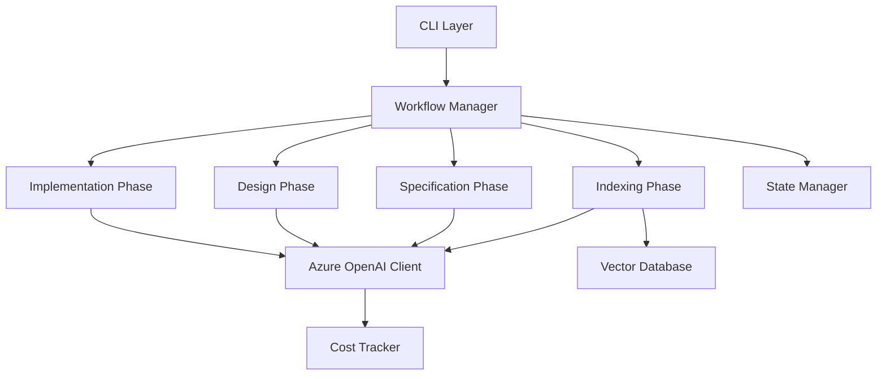

# Architecture

## Overview

dev-agent follows a modular architecture with clear separation of concerns, designed to support AI-powered development workflows using Azure OpenAI.

## High-Level Architecture



## Core Components

### CLI Layer
- **Location**: `dev_agent/cli/`
- **Purpose**: User interface and command handling
- **Key Files**:
  - `main.py`: Typer CLI application entry point
  - `interactive_cli.py`: Chat-based interactive interface
  - `session_manager.py`: Session state management

### Workflow Manager
- **Location**: `dev_agent/workflow/`
- **Purpose**: Orchestrates the four-phase development workflow
- **Key Components**:
  - Phase management and transitions
  - User approval workflows
  - State persistence

### LLM Integration Layer
- **Location**: `dev_agent/llm/`
- **Purpose**: Azure OpenAI integration with retry logic and cost tracking
- **Key Components**:
  - `azure_client.py`: Azure OpenAI client implementation
  - `embeddings.py`: Embedding generation and caching
  - `token_counter.py`: Token counting and cost estimation
  - `cost_tracker.py`: API usage tracking

### Indexing Engine
- **Location**: `dev_agent/indexing/`
- **Purpose**: Code analysis and semantic search
- **Key Components**:
  - Tree-sitter AST parsing
  - Azure OpenAI embeddings
  - FAISS vector storage
  - Semantic code chunking

### Generation Engines
- **Location**: `dev_agent/generation/`
- **Purpose**: AI-powered content generation
- **Key Components**:
  - Specification generation
  - Design document generation
  - Task breakdown generation
  - Code generation

### State Management
- **Location**: `dev_agent/state/`
- **Purpose**: Persistent project state across sessions
- **Key Features**:
  - JSON-based state storage
  - Phase tracking
  - Document versioning

## Design Patterns

### Interface-Based Design
All major components implement abstract interfaces from `dev_agent/interfaces/`, enabling:
- Dependency injection
- Easy testing with mocks
- Clear contracts between components

### Async-First Architecture
All I/O operations use async/await:
- Non-blocking Azure OpenAI API calls
- Concurrent embedding generation
- Streaming responses for CLI

### Enum-Driven State Management
Core enums in `dev_agent/models/enums.py`:
- `PhaseType`: INDEXING, SPECIFICATION, DESIGN, IMPLEMENTATION
- `TaskStatus`: NOT_STARTED, IN_PROGRESS, COMPLETED, FAILED
- `LLMProvider`: AZURE_OPENAI

### Pydantic Models
All data structures use Pydantic v2 for:
- Runtime validation
- Type safety
- Consistent serialization
- Configuration management

## Data Flow

### Indexing Phase
```
Source Code → Tree-sitter Parser → Code Chunks → Azure OpenAI Embeddings → FAISS Vector DB
```

### Generation Phases
```
User Input → Vector Search (Context) → Prompt Template → Azure OpenAI → Generated Content → User Approval
```

### State Persistence
```
Workflow State → Pydantic Models → JSON Serialization → .dev_agent/state.json
```

## Security Architecture

### Credential Management
- Environment variables for all secrets
- Pydantic SecretStr for API keys
- No credentials in logs or error messages

### Data Privacy
- All code stays within Azure tenant
- No data sent to third-party services
- Audit logging for compliance

## Performance Optimizations

### Embedding Cache
- Disk-based cache for generated embeddings
- SHA-256 hashing for cache keys
- Avoids redundant API calls

### Batch Processing
- Batch embedding generation (16 items per batch)
- Concurrent API requests where possible
- FAISS for O(log n) vector search

### Retry Logic
- Exponential backoff with tenacity
- Automatic retry on transient failures
- Rate limit handling

## Extension Points

### Custom LLM Providers
Implement `ILLMClient` interface to add new providers:
- AWS Bedrock (planned)
- Local models (future)

### Custom Analyzers
Extend analysis capabilities:
- Additional language support
- Custom pattern detection
- Framework-specific analysis

### Plugin System
Future plugin architecture for:
- IDE integrations
- Custom generators
- Team collaboration features

## Technology Stack

- **Language**: Python 3.10+
- **AI Provider**: Azure OpenAI (GPT-4, text-embedding-ada-002)
- **Vector DB**: FAISS
- **CLI Framework**: Typer + Rich
- **Code Analysis**: Tree-sitter
- **Data Validation**: Pydantic v2
- **Async Runtime**: asyncio
- **HTTP Client**: httpx

## Related Documentation

- [LLM Integration](llm-integration.md) - Detailed Azure OpenAI integration guide
- [Contributing](contributing.md) - Development guidelines
- [Testing](testing.md) - Testing strategy and practices
