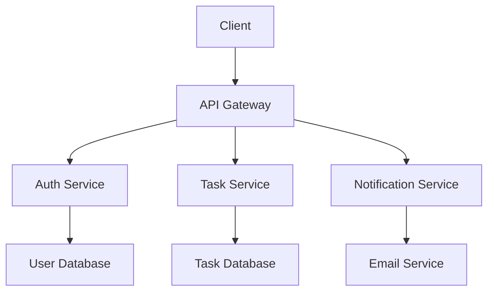

# Basic Usage Examples

Practical examples of using dev-agent for common development scenarios.

## Example 1: New Web API Project

Let's create a REST API for a task management system.

### Initialize Project

```bash
mkdir task-api
cd task-api
uv run dev-agent init
```

### Indexing Phase (Skipped)
Since this is a new project, indexing finds no existing code:

```
🔍 Starting indexing phase...
📊 No existing code found
✅ Indexing complete - ready for specification
```

### Specification Phase

```bash
dev-agent> next
📝 Starting specification generation...
💬 Let's collect your requirements:

Requirement 1: Users can create, read, update, and delete tasks
Requirement 2: Tasks have title, description, due date, and priority
Requirement 3: Users can filter tasks by status and priority  
Requirement 4: API provides JWT authentication
Requirement 5: System sends email notifications for due tasks
Requirement 6: [Press Enter to finish]

✅ Generated specification with 5 requirements
```

Review the generated specification:

```bash
dev-agent> show spec
```

```markdown
# Requirements Document

## Introduction
This document outlines requirements for a task management REST API system.

## Key Features
- Task CRUD operations
- User authentication with JWT
- Task filtering and search
- Email notifications
- Priority management

## Requirements

### Requirement 1: Task Management
**User Story:** As a user, I want to manage tasks, so that I can track my work.

#### Acceptance Criteria
1. WHEN I create a task THEN the system SHALL store it with all required fields
2. WHEN I update a task THEN the system SHALL preserve data integrity
3. WHEN I delete a task THEN the system SHALL remove it permanently
4. WHEN I retrieve tasks THEN the system SHALL return current data

### Requirement 2: Task Properties
**User Story:** As a user, I want tasks to have detailed information, so that I can organize effectively.

#### Acceptance Criteria
1. WHEN I create a task THEN it SHALL have title, description, due date, and priority
2. WHEN I set a due date THEN it SHALL be validated for future dates
3. WHEN I set priority THEN it SHALL be one of: low, medium, high, urgent

[... additional requirements ...]
```

Approve the specification:

```bash
dev-agent> approve
✅ Specification approved and saved
```

### Design Phase

```bash
dev-agent> next
🏗️ Starting design phase...
📐 Creating technical design based on specification...
✅ Generated design with 6 components
```

Review the design:

```bash
dev-agent> show design
```

```markdown
# Technical Design Document

## Architecture Overview



## Components

### Task Service
- **Purpose**: Handle task CRUD operations
- **Endpoints**: 
  - GET /tasks - List tasks with filtering
  - POST /tasks - Create new task
  - PUT /tasks/{id} - Update task
  - DELETE /tasks/{id} - Delete task
- **Models**: Task, TaskFilter, TaskStatus
- **Dependencies**: Database, Authentication

### Authentication Service  
- **Purpose**: Handle user authentication and authorization
- **Endpoints**:
  - POST /auth/login - User login
  - POST /auth/refresh - Token refresh
  - POST /auth/logout - User logout
- **Models**: User, Token, LoginRequest
- **Dependencies**: User Database, JWT Library

[... additional components ...]
```

Approve the design:

```bash
dev-agent> approve
✅ Design approved and saved
```

### Implementation Phase

```bash
dev-agent> next
⚡ Starting implementation phase...
🔨 Generating Python code based on design...
✅ Generated 8 modules with comprehensive tests
```

Review generated files:

```bash
dev-agent> show tasks
```

```
📋 Implementation Tasks:
✅ Create task models (models/task.py)
✅ Create user models (models/user.py)  
✅ Create task service (services/task_service.py)
✅ Create auth service (services/auth_service.py)
✅ Create task endpoints (api/tasks.py)
✅ Create auth endpoints (api/auth.py)
✅ Create database setup (database.py)
✅ Create main application (main.py)
✅ Generate comprehensive tests
✅ Create configuration files
```

Approve implementation:

```bash
dev-agent> approve
✅ Implementation complete!
🎉 All phases completed successfully!

dev-agent> export ./generated-code
📁 Exported all artifacts to ./generated-code/
```

### Generated Code Structure

```
generated-code/
├── models/
│   ├── __init__.py
│   ├── task.py
│   └── user.py
├── services/
│   ├── __init__.py
│   ├── task_service.py
│   └── auth_service.py
├── api/
│   ├── __init__.py
│   ├── tasks.py
│   └── auth.py
├── tests/
│   ├── test_task_service.py
│   ├── test_auth_service.py
│   └── test_api.py
├── database.py
├── main.py
├── config.py
└── requirements.txt
```

### Sample Generated Code

**models/task.py:**
```python
from datetime import datetime
from enum import Enum
from typing import Optional
from pydantic import BaseModel, Field

class TaskPriority(str, Enum):
    """Task priority levels."""
    LOW = "low"
    MEDIUM = "medium"
    HIGH = "high"
    URGENT = "urgent"

class TaskStatus(str, Enum):
    """Task status options."""
    TODO = "todo"
    IN_PROGRESS = "in_progress"
    COMPLETED = "completed"

class Task(BaseModel):
    """Task model with all required fields."""
    id: Optional[int] = None
    title: str = Field(..., min_length=1, max_length=200)
    description: Optional[str] = Field(None, max_length=1000)
    due_date: Optional[datetime] = None
    priority: TaskPriority = TaskPriority.MEDIUM
    status: TaskStatus = TaskStatus.TODO
    created_at: Optional[datetime] = None
    updated_at: Optional[datetime] = None
    user_id: int

    class Config:
        """Pydantic configuration."""
        from_attributes = True
```

## Example 2: Extending Existing Project

Let's add features to an existing Flask application.

### Resume Existing Project

```bash
cd my-flask-app
uv run dev-agent resume
```

```
✅ Resumed project at /home/user/my-flask-app
🔍 Re-indexing codebase for changes...
📊 Analyzed 89 files, 7,234 lines of code
📋 Detected Flask application with SQLAlchemy
🎯 Found patterns: Blueprint structure, Marshmallow serialization
✅ Indexing complete
```

### Add New Features

```bash
dev-agent> next
📝 Starting specification generation...
💬 Based on existing code, I can see you have a Flask app with user management.
💬 What new features would you like to add?

New Feature 1: Add file upload functionality for user avatars
New Feature 2: Add email notifications for account changes
New Feature 3: Add admin dashboard for user management
New Feature 4: [Press Enter to finish]

✅ Generated specification for 3 new features
```

The system generates requirements that integrate with existing patterns:

```markdown
### Requirement 1: File Upload System
**User Story:** As a user, I want to upload avatar images, so that I can personalize my profile.

#### Acceptance Criteria
1. WHEN I upload an image THEN it SHALL be validated for type and size
2. WHEN upload succeeds THEN it SHALL be stored securely
3. WHEN I view my profile THEN it SHALL display my avatar

#### Integration Notes
- Extends existing User model
- Uses current Flask-SQLAlchemy patterns
- Follows existing Blueprint structure
- Integrates with current authentication system
```

### Generated Integration Code

The implementation phase generates code that seamlessly integrates:

**models/user.py (updated):**
```python
# Extends existing User model
class User(db.Model):
    # ... existing fields ...
    avatar_filename: Optional[str] = db.Column(db.String(255))
    avatar_uploaded_at: Optional[datetime] = db.Column(db.DateTime)
    
    @property
    def avatar_url(self) -> Optional[str]:
        """Get avatar URL if available."""
        if self.avatar_filename:
            return url_for('static', filename=f'avatars/{self.avatar_filename}')
        return None
```

**blueprints/upload.py (new):**
```python
from flask import Blueprint, request, current_app
from werkzeug.utils import secure_filename
from your_app.models import User  # Uses existing import pattern
from your_app.auth import login_required  # Uses existing auth

upload_bp = Blueprint('upload', __name__)

@upload_bp.route('/upload/avatar', methods=['POST'])
@login_required
def upload_avatar():
    """Upload user avatar following existing patterns."""
    # Implementation follows your existing Flask patterns...
```

## Example 3: Documentation Generation

Generate documentation for an existing codebase.

### Analyze for Documentation

```bash
cd my-python-library
uv run dev-agent init --mode=documentation
```

```
🔍 Analyzing codebase for documentation generation...
📊 Found 45 public functions, 12 classes, 8 modules
📋 Detected missing docstrings: 23 functions, 4 classes
🎯 Documentation coverage: 67%
```

### Generate Documentation

```bash
dev-agent> next
📝 Generating comprehensive documentation...
✅ Created API documentation for all public interfaces
✅ Generated usage examples for main functions
✅ Created getting started guide
✅ Generated changelog from git history
```

### Review Generated Docs

```bash
dev-agent> show docs
```

The system generates:
- Complete API documentation with examples
- Usage guides based on existing code patterns
- Integration examples
- Missing docstrings for functions

## Example 4: Test Generation

Add comprehensive tests to existing code.

### Analyze Testing Gaps

```bash
uv run dev-agent init --mode=testing
```

```
🔍 Analyzing test coverage...
📊 Current coverage: 45%
📋 Missing tests: 23 functions, 8 edge cases
🎯 Found existing pytest patterns
```

### Generate Tests

The system generates tests following existing patterns:

```python
# Generated test following existing patterns
def test_user_creation_with_avatar(client, db_session):
    """Test user creation with avatar upload."""
    # Follows existing test structure and fixtures
    user_data = {
        'username': 'testuser',
        'email': 'test@example.com',
        'password': 'secure_password'
    }
    
    with open('tests/fixtures/test_avatar.jpg', 'rb') as avatar:
        user_data['avatar'] = avatar
        response = client.post('/api/users', data=user_data)
    
    assert response.status_code == 201
    assert 'avatar_url' in response.json
    # Additional assertions following existing patterns...
```

## Tips for Success

### Before Starting
1. **Clean up code** - Fix syntax errors and warnings
2. **Organize structure** - Use consistent file organization  
3. **Document goals** - Have clear objectives in mind

### During Process
1. **Review each phase** - Don't rush through approvals
2. **Provide feedback** - Use reject/retry for improvements
3. **Test incrementally** - Verify outputs at each stage

### After Generation
1. **Code review** - Treat generated code like any PR
2. **Integration testing** - Test with existing systems
3. **Refine and iterate** - Use learnings for next session

## Next Steps

- [Advanced Examples](advanced.md) - Complex usage patterns
- [CLI Reference](../usage/cli.md) - Complete command documentation
- [Workflow Guide](../usage/workflow.md) - Understanding the process
- [API Reference](../api/cli.md) - Developer documentation