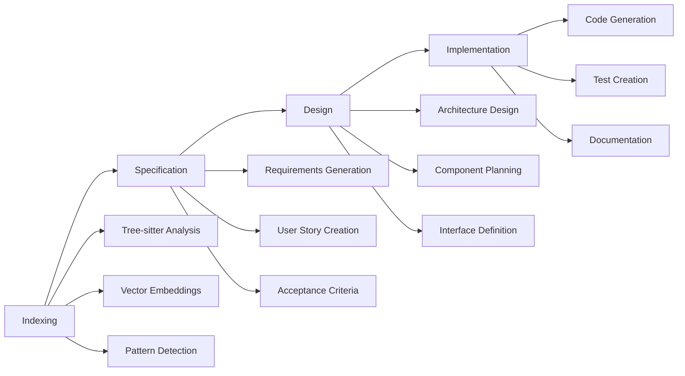

# dev-agent

AI-powered development workflow assistant that implements a structured four-phase development process for Python projects.

## Overview

dev-agent is designed to help developers understand, document, and extend large Python codebases through comprehensive analysis and intelligent code generation. It follows a systematic four-phase approach to ensure thorough understanding and quality output.

## Key Features

- **🔍 High-Performance Indexing**: Analyzes large codebases using Tree-sitter and vector embeddings
- **📋 Intelligent Specification Generation**: Creates detailed requirements from existing code or user input
- **🏗️ Technical Design Creation**: Generates comprehensive design documents
- **⚡ Context-Aware Implementation**: Produces Python code consistent with existing patterns
- **💬 Interactive CLI**: Chat-based interface with user approval workflows
- **🔄 Session Management**: Persistent state across development sessions

## Four-Phase Workflow



### 1. Indexing Phase
Analyzes your existing codebase to understand:
- Code structure and patterns
- Dependencies and relationships  
- Naming conventions and styles
- Testing approaches

### 2. Specification Phase
Generates detailed requirements including:
- Functional requirements in EARS format
- User stories with acceptance criteria
- Technical constraints and dependencies
- Integration requirements

### 3. Design Phase
Creates comprehensive technical designs:
- System architecture diagrams
- Component interfaces and contracts
- Data flow and state management
- Error handling strategies

### 4. Implementation Phase
Produces production-ready code:
- Python modules following project patterns
- Comprehensive test suites
- Documentation and docstrings
- Integration with existing systems

## Quick Start

### Installation

```bash
# Install uv (modern Python package manager)
curl -LsSf https://astral.sh/uv/install.sh | sh

# Clone and install dev-agent
git clone https://github.com/dev-agent/dev-agent.git
cd dev-agent
uv sync --dev
```

### Initialize a New Project

```bash
# Initialize in current directory
uv run dev-agent init

# Initialize in specific directory
uv run dev-agent init /path/to/project
```

### Resume Existing Project

```bash
# Resume in current directory
uv run dev-agent resume

# Resume specific project
uv run dev-agent resume /path/to/project
```

### Interactive Mode

```bash
# Start interactive session
uv run dev-agent

# With specific project path
uv run dev-agent /path/to/project
```

## Example Session

```bash
$ uv run dev-agent init my-project
✅ Initialized new dev-agent project
🔍 Starting indexing phase...
📊 Analyzed 1,247 files, 45,892 lines of code
✅ Indexing complete

💬 Ready for specification phase. Shall we proceed? (y/n): y
📝 Generating specification from existing codebase...
📋 Created specification with 12 functional requirements
✅ Specification approved

🏗️ Ready for design phase. Shall we proceed? (y/n): y
📐 Creating technical design...
🎯 Generated architecture with 8 components
✅ Design approved

⚡ Ready for implementation phase. Shall we proceed? (y/n): y
🔨 Generating Python code...
✅ Created 5 new modules with tests
🎉 Implementation complete!
```

## Technology Stack

- **Python 3.10+**: Modern Python with latest features
- **Typer + Rich**: Beautiful CLI with enhanced output
- **Pydantic v2**: Type-safe data models and validation
- **FastAPI**: Ready for future API features
- **Tree-sitter**: High-performance code parsing
- **FAISS**: Vector similarity search for code analysis
- **Ruff**: Lightning-fast linting and formatting
- **pytest**: Comprehensive testing framework

## Next Steps

- [Installation Guide](installation.md) - Detailed setup instructions
- [CLI Usage](usage/cli.md) - Complete command reference
- [Workflow Guide](usage/workflow.md) - Understanding the four phases
- [API Reference](api/cli.md) - Developer documentation
- [Examples](examples/basic-usage.md) - Practical usage examples

## Support

- 📖 [Documentation](https://dev-agent.github.io/dev-agent/)
- 🐛 [Issue Tracker](https://github.com/dev-agent/dev-agent/issues)
- 💬 [Discussions](https://github.com/dev-agent/dev-agent/discussions)
- 📧 [Email Support](mailto:support@dev-agent.dev)