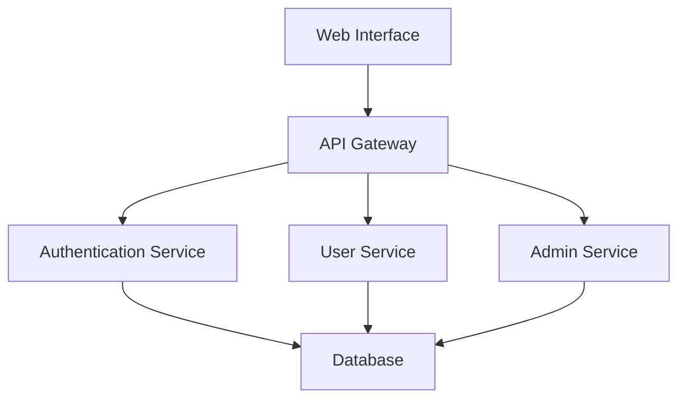

# Workflow Guide

Understanding dev-agent's four-phase development process.

## Overview

dev-agent follows a systematic four-phase approach to software development:

1. **Indexing** - Analyze existing codebase
2. **Specification** - Generate detailed requirements  
3. **Design** - Create technical architecture
4. **Implementation** - Generate production code

Each phase builds on the previous one and requires user approval before proceeding.

## Phase 1: Indexing

### Purpose
Analyze your existing codebase to understand patterns, structure, and conventions.

### What It Does
- **AST Analysis**: Parse Python files using Tree-sitter
- **Pattern Detection**: Identify naming conventions, code styles
- **Dependency Mapping**: Understand module relationships
- **Vector Embeddings**: Create searchable code representations

### Example Output
```
🔍 Indexing Phase Results:
📊 Analyzed 1,247 files (45,892 lines)
📋 Found 156 functions, 23 classes, 8 modules
🎯 Detected patterns:
   - snake_case function naming (95% confidence)
   - Google-style docstrings (87% confidence)
   - pytest testing framework (100% confidence)
   - FastAPI web framework (92% confidence)
```

### When to Skip
- New projects with no existing code
- Prototypes or proof-of-concepts
- When starting completely fresh

## Phase 2: Specification

### Purpose
Generate detailed functional requirements and user stories.

### Input Sources
- **Existing Code**: Analyze current functionality
- **User Input**: Collect requirements interactively
- **Documentation**: Parse existing docs and comments

### Output Format
Requirements follow the EARS (Easy Approach to Requirements Syntax) format:

```markdown
### Requirement 1: User Authentication

**User Story:** As a user, I want to authenticate securely, so that I can access protected resources.

#### Acceptance Criteria
1. WHEN I provide valid credentials THEN the system SHALL authenticate me
2. WHEN I provide invalid credentials THEN the system SHALL reject access
3. WHEN I am authenticated THEN the system SHALL provide a JWT token

#### Supporting Evidence
- **Files**: auth/models.py, auth/views.py
- **Functions**: login_user, validate_token, refresh_token
- **Confidence**: 92%
```

### Interactive Collection
```bash
dev-agent> next
📝 Starting specification generation...
💬 No existing code detected. Let's collect requirements.

Requirement 1: Users should be able to create accounts
Requirement 2: System should send email confirmations  
Requirement 3: Admins can manage user permissions
Requirement 4: [Press Enter to finish]

✅ Generated specification with 3 requirements
```

## Phase 3: Design

### Purpose
Create comprehensive technical design and architecture.

### Design Components
- **System Architecture**: High-level component diagram
- **Data Models**: Database schema and relationships
- **API Interfaces**: Endpoint definitions and contracts
- **Component Interactions**: Sequence diagrams and flows

### Example Output
```markdown
# Technical Design Document

## Architecture Overview


## Components

### Authentication Service
- **Purpose**: Handle user login/logout and token management
- **Interfaces**: REST API, JWT tokens
- **Dependencies**: Database, Email Service
- **Files**: auth/service.py, auth/models.py
```

### Design Validation
- Checks for consistency with requirements
- Validates against existing code patterns
- Ensures scalability and maintainability
- Reviews security considerations

## Phase 4: Implementation

### Purpose
Generate production-ready Python code with tests.

### Code Generation
- **Module Structure**: Following project conventions
- **Function Implementation**: Based on design specifications
- **Test Coverage**: Comprehensive test suites
- **Documentation**: Docstrings and inline comments

### Example Generated Code
```python
from typing import Optional
from pydantic import BaseModel, EmailStr
from passlib.context import CryptContext

class UserService:
    """Service for managing user operations."""
    
    def __init__(self, db_session: Session):
        """Initialize user service with database session."""
        self.db = db_session
        self.pwd_context = CryptContext(schemes=["bcrypt"])
    
    async def create_user(self, email: EmailStr, password: str) -> User:
        """Create a new user account.
        
        Args:
            email: User's email address
            password: Plain text password
            
        Returns:
            Created user instance
            
        Raises:
            UserExistsError: If email already registered
        """
        # Implementation follows project patterns...
```

### Quality Assurance
- Follows existing code style and patterns
- Includes comprehensive error handling
- Provides complete test coverage
- Maintains type safety with annotations

## Workflow Control

### User Approval Process
Each phase requires explicit approval:

```bash
dev-agent> status
📊 Current Phase: Specification (ready for review)

dev-agent> show spec
[Specification document displayed]

dev-agent> approve    # Proceed to next phase
dev-agent> reject     # Request changes
dev-agent> retry      # Regenerate current phase
```

### Phase Navigation
```bash
# Move forward
dev-agent> next       # Proceed to next phase
dev-agent> skip       # Skip current phase (with confirmation)

# Review and control
dev-agent> approve    # Approve current output
dev-agent> reject     # Reject and provide feedback
dev-agent> retry      # Regenerate current phase

# Information
dev-agent> status     # Show current state
dev-agent> history    # Show session history
dev-agent> progress   # Detailed progress view
```

### Session Management
```bash
# Save current state
dev-agent> save session-name

# Load previous session
dev-agent> load session-name

# Export artifacts
dev-agent> export /path/to/output
```

## Best Practices

### Preparation
1. **Clean Codebase**: Ensure code is well-organized
2. **Clear Requirements**: Have a general idea of goals
3. **Backup Project**: Save current state before starting

### During Workflow
1. **Review Carefully**: Each phase builds on the previous
2. **Provide Feedback**: Use reject/retry for improvements
3. **Save Frequently**: Use session save points
4. **Test Outputs**: Verify generated code works

### After Completion
1. **Integration Testing**: Test generated code thoroughly
2. **Code Review**: Review generated code like any PR
3. **Documentation**: Update project documentation
4. **Iteration**: Use feedback for future improvements

## Troubleshooting

### Common Issues

#### Indexing Fails
```
Error: Failed to parse file syntax_error.py
```
**Solution**: Fix syntax errors in existing code first.

#### Specification Too Vague
```
Warning: Generated requirements lack specificity
```
**Solution**: Provide more detailed input during collection.

#### Design Inconsistencies
```
Warning: Design conflicts with existing patterns
```
**Solution**: Review and approve design changes or modify requirements.

#### Implementation Errors
```
Error: Generated code fails type checking
```
**Solution**: Review design phase for type consistency.

### Recovery Options
- Use `retry` to regenerate current phase
- Use `reject` with specific feedback
- Use `load` to return to previous session state
- Use `skip` to bypass problematic phases

## Advanced Usage

### Custom Workflows
```bash
# Skip indexing for new projects
dev-agent> skip indexing

# Jump to specific phase
dev-agent> goto design

# Batch approve (use carefully)
dev-agent> approve-all
```

### Integration with IDEs
- Export generated code to IDE
- Use IDE for final review and integration
- Leverage IDE debugging for testing

### Team Collaboration
- Share session files for team review
- Export artifacts for version control
- Use consistent configuration across team

## Next Steps

- [CLI Reference](cli.md) - Complete command documentation
- [Configuration](configuration.md) - Customize workflow behavior
- [API Reference](../api/workflow.md) - Developer documentation
- [Examples](../examples/basic-usage.md) - Practical workflow examples