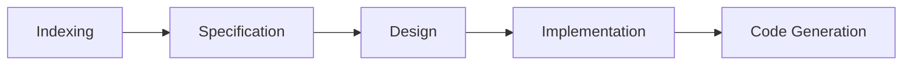

# Four-Phase Workflow Guide

## Overview

dev-agent implements a structured four-phase development workflow that leverages Azure OpenAI to analyze codebases, generate specifications, create designs, and produce implementation plans. This guide walks you through each phase in detail, explaining what happens, what to expect, and how to get the best results.

## Workflow Phases



Each phase builds on the previous one, creating a comprehensive understanding of your project and generating actionable development artifacts.

## Phase 1: Indexing

### Purpose

The indexing phase analyzes your codebase to understand its structure, patterns, and conventions. This creates a searchable knowledge base that informs all subsequent phases.

### What Happens

1. **Code Parsing**: Tree-sitter analyzes Python files to extract:
   - Function and class definitions
   - Import statements and dependencies
   - Code structure and relationships
   - Docstrings and comments

2. **Embedding Generation**: Azure OpenAI creates semantic embeddings for:
   - Individual functions and classes
   - Code modules and packages
   - Documentation and comments
   - Architectural patterns

3. **Vector Storage**: FAISS stores embeddings for fast similarity search:
   - Enables context-aware code retrieval
   - Powers pattern detection
   - Supports intelligent code generation

4. **Pattern Detection**: Identifies coding conventions:
   - Naming patterns
   - Error handling approaches
   - Testing strategies
   - Documentation styles

### Running the Indexing Phase

```bash
# Initialize a new project
dev-agent init /path/to/project

# Or resume an existing project
dev-agent resume /path/to/project
```

### What You'll See

```
🔍 Indexing Phase Started
━━━━━━━━━━━━━━━━━━━━━━━━━━━━━━━━━━━━━━━━━━━━━━━━━━━━━━━━━━━━━━━━━━━━━━━━━━━━━━

📁 Scanning project structure...
   Found 156 Python files

🌳 Parsing code with Tree-sitter...
   ████████████████████████████████████████ 156/156 files (100%)
   
   Extracted:
   • 1,234 functions
   • 456 classes
   • 89 modules

🧠 Generating embeddings with Azure OpenAI...
   ████████████████████████████████████████ 1,690/1,690 chunks (100%)
   
   Processed in batches of 16
   Total tokens: 45,678
   Estimated cost: $0.05

💾 Storing vectors in FAISS...
   Created index with 1,690 vectors (1536 dimensions)

🔍 Detecting patterns...
   • Naming: snake_case for functions, PascalCase for classes
   • Error handling: Custom exceptions with logging
   • Testing: pytest with fixtures
   • Documentation: Google-style docstrings

✅ Indexing Complete
   Duration: 2m 34s
   Cost: $0.05
```

### Tips for Better Indexing

- **Clean Code First**: Remove temporary files and build artifacts
- **Update Dependencies**: Ensure all imports are resolvable
- **Include Tests**: Tests reveal usage patterns and conventions
- **Document Well**: Docstrings improve context understanding
- **Organize Logically**: Clear module structure helps pattern detection

### Common Issues

**Issue**: "Failed to parse file X"
- **Solution**: Check for syntax errors in the file
- **Workaround**: Add to `.dev_agent/ignore_patterns.txt`

**Issue**: "Embedding generation slow"
- **Solution**: Reduce batch size in configuration
- **Optimization**: Use embedding cache for repeated runs

**Issue**: "High token usage"
- **Solution**: Exclude large generated files
- **Tip**: Focus on source code, not documentation sites

## Phase 2: Specification

### Purpose

Generate detailed technical specifications based on your codebase analysis and feature requirements. Specifications define what needs to be built while respecting existing patterns.

### What Happens

1. **Context Retrieval**: Vector search finds relevant code examples
2. **Pattern Analysis**: Identifies architectural patterns to follow
3. **GPT-4 Generation**: Creates specification using codebase context
4. **User Review**: You approve or request changes

### Running the Specification Phase

```bash
# Interactive mode (recommended)
dev-agent

# Then follow prompts to describe your feature

# Or specify directly
dev-agent phase specification --feature "Add user authentication"
```

### What You'll See

```
📝 Specification Phase Started
━━━━━━━━━━━━━━━━━━━━━━━━━━━━━━━━━━━━━━━━━━━━━━━━━━━━━━━━━━━━━━━━━━━━━━━━━━━━━━

📋 Feature Description:
   "Add JWT-based user authentication with role-based access control"

🔍 Searching for relevant code...
   Found 12 similar implementations:
   • auth/session_manager.py (similarity: 0.89)
   • api/middleware.py (similarity: 0.84)
   • models/user.py (similarity: 0.82)
   • ...

🎨 Analyzing patterns...
   • Authentication: Token-based with refresh
   • Authorization: Decorator-based role checks
   • Storage: SQLAlchemy models with Pydantic validation
   • Error handling: Custom exceptions with HTTP status codes

🤖 Generating specification with GPT-4...
   
   [Streaming response appears here in real-time]
   
   # User Authentication Specification
   
   ## Overview
   Implement JWT-based authentication system with role-based
   access control, following existing patterns in the codebase...
   
   ## Functional Requirements
   1. User registration with email validation
   2. Login with JWT token generation
   ...

💰 Cost Summary:
   Prompt tokens: 3,456
   Completion tokens: 2,134
   Total cost: $0.18

✅ Specification Generated
   Saved to: .dev_agent/documents/specification.md
```

### Reviewing the Specification

The generated specification will include:

- **Overview**: High-level description of the feature
- **Functional Requirements**: What the feature must do
- **Technical Requirements**: How it should be implemented
- **Acceptance Criteria**: How to verify it works
- **Dependencies**: Required libraries and services
- **Security Considerations**: Authentication, authorization, data protection
- **Testing Requirements**: Unit, integration, and end-to-end tests

### Approval Process

```bash
# Review the specification
cat .dev_agent/documents/specification.md

# Approve to continue
dev-agent approve

# Or request changes
dev-agent reject --feedback "Add password reset functionality"
```

### Tips for Better Specifications

- **Be Specific**: Detailed feature descriptions yield better specs
- **Provide Examples**: Reference similar features in your codebase
- **Review Carefully**: Specifications guide all subsequent phases
- **Iterate**: Don't hesitate to reject and refine
- **Consider Edge Cases**: Think about error scenarios

## Phase 3: Design

### Purpose

Create technical design documents that detail how to implement the specification while maintaining consistency with your codebase architecture.

### What Happens

1. **Architecture Analysis**: Understands existing design patterns
2. **Component Design**: Plans new components and their interactions
3. **Integration Planning**: Determines how new code fits with existing code
4. **GPT-4 Generation**: Creates detailed design document

### Running the Design Phase

```bash
# After specification approval
dev-agent phase design

# Or in interactive mode, it proceeds automatically
```

### What You'll See

```
🎨 Design Phase Started
━━━━━━━━━━━━━━━━━━━━━━━━━━━━━━━━━━━━━━━━━━━━━━━━━━━━━━━━━━━━━━━━━━━━━━━━━━━━━━

📖 Loading specification...
   Read from: .dev_agent/documents/specification.md

🏗️ Analyzing architecture...
   • Pattern: Layered architecture (API → Service → Repository)
   • Framework: FastAPI with Pydantic models
   • Database: SQLAlchemy ORM with PostgreSQL
   • Testing: pytest with fixtures and mocks

🔍 Finding similar implementations...
   Found 8 relevant design patterns:
   • Service layer pattern in user_service.py
   • Repository pattern in base_repository.py
   • Middleware pattern in auth_middleware.py
   • ...

🤖 Generating design with GPT-4...
   
   [Streaming response appears here]
   
   # User Authentication Design
   
   ## Architecture Overview
   The authentication system follows the existing layered
   architecture pattern...
   
   ## Components
   
   ### 1. Authentication Service
   - Location: `auth/auth_service.py`
   - Responsibilities: Token generation, validation, refresh
   ...

💰 Cost Summary:
   Prompt tokens: 4,567
   Completion tokens: 3,245
   Total cost: $0.24

✅ Design Complete
   Saved to: .dev_agent/documents/design.md
```

### Design Document Contents

The generated design includes:

- **Architecture Overview**: How components fit together
- **Component Specifications**: Detailed component designs
- **Data Models**: Database schemas and Pydantic models
- **API Endpoints**: REST API design with request/response formats
- **Security Design**: Authentication, authorization, encryption
- **Error Handling**: Exception hierarchy and error responses
- **Testing Strategy**: Unit, integration, and E2E test plans
- **Performance Considerations**: Caching, optimization strategies

### Approval Process

```bash
# Review the design
cat .dev_agent/documents/design.md

# Approve to continue
dev-agent approve

# Or request changes
dev-agent reject --feedback "Add caching layer for tokens"
```

### Tips for Better Designs

- **Verify Patterns**: Ensure design matches your architecture
- **Check Dependencies**: Confirm all required libraries are available
- **Review Security**: Pay special attention to security design
- **Consider Scale**: Think about performance implications
- **Plan Testing**: Ensure testability is built into the design

## Phase 4: Implementation

### Purpose

Generate actionable implementation tasks that break down the design into manageable coding steps, with each task building on previous ones.

### What Happens

1. **Task Breakdown**: Divides design into discrete coding tasks
2. **Dependency Analysis**: Orders tasks based on dependencies
3. **Test Planning**: Includes testing tasks for each component
4. **GPT-4 Generation**: Creates detailed task list

### Running the Implementation Phase

```bash
# After design approval
dev-agent phase implementation

# Or let it proceed automatically in interactive mode
```

### What You'll See

```
⚙️ Implementation Phase Started
━━━━━━━━━━━━━━━━━━━━━━━━━━━━━━━━━━━━━━━━━━━━━━━━━━━━━━━━━━━━━━━━━━━━━━━━━━━━━━

📖 Loading design...
   Read from: .dev_agent/documents/design.md

🔨 Breaking down into tasks...
   Analyzing dependencies...
   Ordering tasks...
   Planning test coverage...

🤖 Generating implementation plan with GPT-4...
   
   [Streaming response appears here]
   
   # Implementation Tasks
   
   ## Task 1: Create Authentication Models
   - Create User model with SQLAlchemy
   - Add Pydantic schemas for validation
   - Implement password hashing
   - Write model tests
   
   Files to create:
   - `models/user.py`
   - `schemas/user_schema.py`
   - `tests/test_user_model.py`
   ...

💰 Cost Summary:
   Prompt tokens: 5,123
   Completion tokens: 2,876
   Total cost: $0.21

✅ Implementation Plan Complete
   Saved to: .dev_agent/documents/tasks.md
   Total tasks: 12
```

### Task List Structure

Each task includes:

- **Task Number**: Sequential numbering
- **Description**: What needs to be done
- **Files**: Which files to create or modify
- **Dependencies**: Which tasks must be completed first
- **Testing**: Associated test requirements
- **Acceptance Criteria**: How to verify completion

### Executing Tasks

```bash
# View all tasks
dev-agent tasks list

# Work on specific task
dev-agent tasks start 1

# Generate code for task
dev-agent generate --task 1

# Mark task complete
dev-agent tasks complete 1

# View progress
dev-agent status
```

### Tips for Implementation

- **Follow Order**: Complete tasks in sequence
- **Test Incrementally**: Run tests after each task
- **Review Generated Code**: Always review before committing
- **Commit Frequently**: Commit after each completed task
- **Update Documentation**: Keep docs in sync with code

## Complete Workflow Example

Here's a complete workflow from start to finish:

```bash
# 1. Initialize project
dev-agent init /path/to/my-project

# 2. Wait for indexing to complete
# Review indexing summary

# 3. Start interactive mode
dev-agent

# 4. Describe feature when prompted
> "Add user authentication with JWT tokens and role-based access control"

# 5. Review generated specification
# Approve or request changes

# 6. Review generated design
# Approve or request changes

# 7. Review implementation tasks
# Approve to proceed

# 8. Execute tasks one by one
dev-agent tasks start 1
dev-agent generate --task 1
# Review and test generated code
dev-agent tasks complete 1

# Repeat for each task...

# 9. Final verification
pytest
dev-agent audit

# 10. Commit changes
git add .
git commit -m "feat: add user authentication system"
```

## Cost Management

### Typical Costs per Phase

- **Indexing**: $0.05 - $0.50 (depends on codebase size)
- **Specification**: $0.10 - $0.30 (depends on complexity)
- **Design**: $0.15 - $0.40 (depends on detail level)
- **Implementation**: $0.10 - $0.25 (depends on task count)

**Total per feature**: $0.40 - $1.45

### Cost Optimization Tips

1. **Use Embedding Cache**: Avoid re-indexing unchanged code
2. **Be Specific**: Clear requirements reduce iteration
3. **Approve Quickly**: Each rejection/regeneration costs tokens
4. **Batch Features**: Group related features together
5. **Monitor Usage**: Use `dev-agent cost` to track spending

## Best Practices

### Before Starting

- ✅ Clean up temporary files
- ✅ Ensure code compiles
- ✅ Update dependencies
- ✅ Review .gitignore
- ✅ Set budget limits

### During Workflow

- ✅ Review each phase carefully
- ✅ Provide detailed feedback
- ✅ Test incrementally
- ✅ Commit frequently
- ✅ Monitor costs

### After Completion

- ✅ Run full test suite
- ✅ Review all generated code
- ✅ Update documentation
- ✅ Perform code review
- ✅ Check cost report

## Troubleshooting

### Indexing Issues

**Problem**: Indexing takes too long
- **Solution**: Exclude large directories in `.dev_agent/config.json`
- **Example**: `{"exclude_patterns": ["node_modules/", "venv/", "*.min.js"]}`

**Problem**: High embedding costs
- **Solution**: Enable embedding cache
- **Command**: `dev-agent config set embedding_cache true`

### Specification Issues

**Problem**: Specification doesn't match requirements
- **Solution**: Reject and provide detailed feedback
- **Tip**: Reference specific examples from your codebase

**Problem**: Missing security considerations
- **Solution**: Explicitly mention security in feature description
- **Example**: "Add authentication with secure password hashing and token encryption"

### Design Issues

**Problem**: Design doesn't follow existing patterns
- **Solution**: Ensure indexing captured relevant code
- **Tip**: Reference specific files in rejection feedback

**Problem**: Missing error handling
- **Solution**: Reject and request comprehensive error handling
- **Tip**: Mention your existing error handling patterns

### Implementation Issues

**Problem**: Tasks are too large
- **Solution**: Request smaller, more granular tasks
- **Feedback**: "Break task 3 into smaller subtasks"

**Problem**: Generated code doesn't compile
- **Solution**: Review and fix manually, then provide feedback
- **Tip**: Report issues to improve future generations

## Next Steps

- Learn about [Cost Management](cost-management.md)
- Explore [Best Practices](best-practices.md)
- Try [Advanced Usage](advanced-usage.md)
- Review [CLI Reference](../cli-reference/commands.md)
